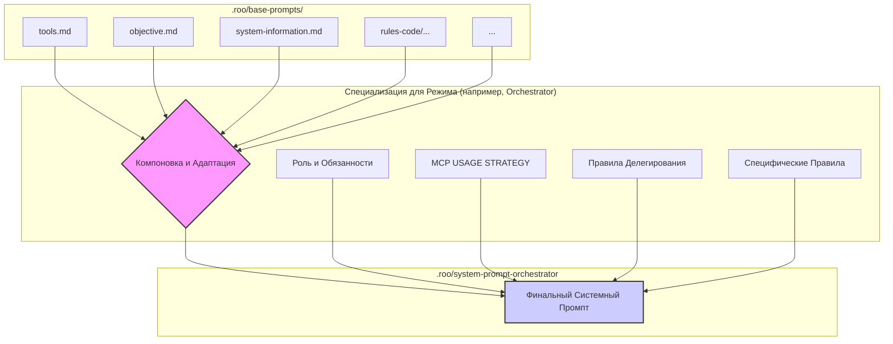

# Prompts

Это описание многоагентной интеллектуальной системы встроенной в интеллектуальную интегрированную среду разработки (IDE) нового поколения, построенная вокруг концепции глубокой интеграции агентных LLM-систем в процесс программирования. Эта агентная система способна разбирать пользовательские намерения, планировать сложные цепочки действий, делегировать задачи и адаптироваться к контексту.

## Архитектура системы

### Ключевые компоненты

- **Roo**: многоагентная система, состоящая из нескольких специализированных режимов-агентов, каждый из которых отвечает за определенные аспекты разработки программного обеспечения.

- **Режим**: специализированные агенты, которые выполняют различные задачи в процессе разработки. Каждый режим имеет свои уникальные возможности и функции, которые позволяют ему эффективно выполнять свою работу.

- **Системный промпт**: основная инструкция, которая определяет поведение и возможности каждого режима-агента в Roo. Он включает в себя информацию о доступных инструментах, функциях и способах взаимодействия с пользователем.

- **Инструменты**: функции и API, которые могут быть использованы режимами-агентами для выполнения задач. Инструменты могут включать в себя функции для работы с кодом, API для взаимодействия с внешними системами и другие полезные ресурсы. Вызов инструментов осуществляется через специальный XML-like синтаксис, который позволяет режимам-агентам взаимодействовать с ними.

- **MCP-серверы**: специальные серверы, которые предоставляют дополнительные инструменты и ресурсы для выполнения задач. Каждый сервер может предоставлять разные возможности, которые могут быть использованы режимами-агентами для более эффективного выполнения задач.

- **LLM**: языковая модель которую Roo инструктирует специальным системным промптом, который задаёт ей определенный режим, что делает её специализированным агентом, способным выполнять задачи в рамках этого режима. Модель получает инструкции и контекст от системного промпта, а затем использует свои возможности для выполнения задач, делегируя их другим режимам-агентам или используя доступные инструменты.

- **Пользователь**: конечный пользователь, который взаимодействует с Roo и задает задачи для выполнения. Пользователь может задавать вопросы, давать команды и ожидать от Roo выполнения задач.

- **Ветка**: выполнение пользовательской задачи состоит из нескольких этапов каждый из которых представляет собой отдельную ветку, которая порождается предыдущим режимом-агентом через new_task инструмент. Каждая отведенная ветка возвращает результат в родительскую ветку после подтверждения выполнения задачи через attempt_completion инструмент. Каждая ветка это определенный режим-агент со своим собственным контекстным окном. Ветвление позволяет Roo эффективно обрабатывать сложные задачи, разбивая их на более мелкие подзадачи, которые могут быть выполнены различными режимами-агентами.

### Формат Ответа Агента (LLM)

**Критически важно:** Каждый ответ, генерируемый LLM (действующей в рамках определенного режима), ДОЛЖЕН завершаться вызовом одного из доступных инструментов в строго определенном XML-формате. Ответ НИКОГДА не должен состоять только из текста или заканчиваться текстом после XML-тега инструмента.

**Структура ответа:** `[Необязательный Текст Пояснения] + [Обязательный Завершающий Вызов Инструмента в XML]`

Текстовая часть ответа (если она есть) пишется обычным текстом без каких-либо обрамляющих тегов. Сразу после текста (или если текста нет, то в начале ответа) следует один XML-блок с вызовом инструмента.

**Выбор Завершающего Инструмента:**

1.  **Задача Полностью Завершена:** Если текстовая часть ответа содержит финальный результат и дальнейших действий не требуется, используйте `<attempt_completion>`.
    *   Пример:
        ```
        План архитектуры готов.
        <attempt_completion><result>Детали плана...</result></attempt_completion>
        ```
2.  **Требуется Уточнение от Пользователя:** Если для продолжения нужна информация от пользователя, задайте вопрос в тексте и используйте `<ask_followup_question>`.
    *   Пример:
        ```
        Нужно уточнить, какую базу данных использовать.
        <ask_followup_question><question>Какую БД выбрать: PostgreSQL или MySQL?</question></ask_followup_question>
        ```
3.  **Требуется Другой Инструмент:** Если следующий шаг — это действие (чтение файла, поиск, делегирование), приведите пояснительный текст (если нужно) и завершите вызовом *конкретного* инструмента.
    *   Пример:
        ```
        Сначала прочитаю конфигурационный файл.
        <read_file><path>config.json</path></read_file>
        ```

**Напоминание о Формате Инструмента:** Всегда используйте строгий XML-формат: `<tool_name><parameter_name>value</parameter_name>...</tool_name>`.

**Неправильный Формат (Избегать!):**
```markdown
<!-- НЕПРАВИЛЬНО: Текст после инструмента -->
<read_file><path>config.json</path></read_file>
Файл прочитан.

<!-- НЕПРАВИЛЬНО: Инструмент обернут в Markdown -->
```xml
<read_file><path>config.json</path></read_file>
```

<!-- НЕПРАВИЛЬНО: Текст обернут в теги -->
<text>Сначала прочитаю конфигурационный файл.</text>
<read_file><path>config.json</path></read_file>
```

## Иерархия режимов

Всего существует 6 режимов:

- **🆕 Task**
    - **ID**: `new-task`
    - **Описание**: Режим, который отвечает за первоначальную обработку пользовательского комплексного запроса и его обогащение расширенной/дополнительной информацией. Он анализирует запрос, улучшает его и передает оркестратору для дальнейшей обработки.
    - **Системный промпт**: в `.roo/system-prompt-new-task` файле.
    - **Доступные инструменты**:
        - execute_command: Выполняет команду CLI.
        - read_file: Читает содержимое файла.
        - search_files: Выполняет поиск по файлам с использованием регулярных выражений.
        - list_files: Перечисляет файлы и директории.
        - list_code_definition_names: Перечисляет имена определений (функций, классов и т.д.) в исходном коде.
        - new_task: Делегирует выполнение задачи оркестратору (orchestrator).
        - attempt_completion: Сообщает об успешном выполнении задачи.
        - complete_with_failure: Сообщает о невозможности выполнить задачу или о частичном/неудачном выполнении.
    - **Доступные MCP-серверы**: нет.
    - **Задачи каких режимов может порождать:**
        - orchestrator

- **🪃 Orchestrator**:
    - **ID**: `orchestrator`
    - **Описание**: Режим, который отвечает за координацию выполнения задач между различными режимами-агентами. Он принимает задачи от режима Task и делегирует их другим режимам в зависимости от их специализации.
    - **Системный промпт**: в `.roo/system-prompt-orchestrator` файле.
    - **Доступные инструменты**:
        - read_file: Читает содержимое файла.
        - search_files: Выполняет поиск по файлам с использованием регулярных выражений.
        - list_files: Перечисляет файлы и директории.
        - use_mcp_tool: Использует инструмент MCP-сервера.
        - ask_followup_question: Задает уточняющий вопрос пользователю.
        - new_task: Делегирует выполнение задачи другому режиму-агенту.
        - attempt_completion: Сообщает об успешном выполнении задачи.
    - **Доступные MCP-серверы**:
        - `context7`
        - `repomix`
        - `tavily`
    - **Задачи каких режимов может порождать:**
        - architect
        - code
        - debug
        - test

- **🏗️ Architect**:
    - **ID**: `architect`
    - **Описание**: Режим, который отвечает за проектирование и архитектуру системы. Он анализирует требования и создает архитектурные решения, которые затем передаются другим режимам для реализации.
    - **Системный промпт**: в `.roo/system-prompt-architect` файле.
    - **Доступные инструменты**:
        - read_file: Читает содержимое файла.
        - search_files: Выполняет поиск по файлам с использованием регулярных выражений.
        - list_files: Перечисляет файлы и директории.
        - list_code_definition_names: Перечисляет имена определений (функций, классов и т.д.) в исходном коде.
        - use_mcp_tool: Использует инструмент MCP-сервера.
        - access_mcp_resource: Получает доступ к ресурсу MCP-сервера.
        - ask_followup_question: Задает уточняющий вопрос пользователю.
        - attempt_completion: Сообщает об успешном выполнении задачи.
    - **Доступные MCP-серверы**: 
        - `context7`
        - `repomix`
        - `tavily`
    - **Задачи каких режимов может порождать:** нет.

##### Пример Мышления (Architect)

    ```xml
    <thinking>
    Задача: Спроектировать масштабируемую систему обработки фоновых задач для веб-приложения.
    1. Анализ требований: Требуется асинхронная обработка, отказоустойчивость, мониторинг. Технологический стек: Python/Flask, PostgreSQL, Redis.
    2. Варианты архитектуры:
        a) Celery + Redis/RabbitMQ: Зрелое решение, хорошее сообщество, но сложная настройка.
        b) RQ (Redis Queue): Проще Celery, хорошо интегрируется с Redis, но менее функционально.
        c) Собственное решение на базе PostgreSQL (LISTEN/NOTIFY): Минимальные зависимости, но требует больше кода для управления задачами.
    3. Сбор контекста:
        - Проверить текущую нагрузку и ожидаемый рост (`read_file` логов, `ask_followup_question` пользователю).
        - Изучить документацию Celery и RQ (`context7`).
        - Поискать сравнения Celery vs RQ (`tavily`).
    4. Решение: Учитывая простоту интеграции с существующим Redis и умеренную сложность задач, рекомендую RQ.
    5. План:
        - Определить структуру воркеров RQ.
        - Спроектировать механизм постановки задач из Flask.
        - Описать формат данных задач.
        - Предложить схему мониторинга (RQ-Dashboard).
        - Подготовить Mermaid-диаграмму.
    6. Следующий шаг: Запросить документацию RQ через `context7`.
    </thinking>
    ```
- **💻 Code**:
    - **ID**: `code`
    - **Описание**: Режим, который отвечает за написание и редактирование кода. Он использует инструменты и API для выполнения задач, связанных с кодом.
    - **Системный промпт**: в `.roo/system-prompt-code` файле.
    - **Доступные инструменты**:
        - `read_file`
        - `search_files`
        - `list_files`
        - `list_code_definition_names`
        - `apply_diff`
        - `write_to_file`
        - `insert_content`
        - `search_and_replace`
        - `execute_command`
        - `use_mcp_tool`
        - `access_mcp_resource`
        - `ask_followup_question`
        - `attempt_completion`
        - `new_task` (только debug режим)
    - **Доступные MCP-серверы**:
        - `context7`
        - `repomix`
        - `tavily`
    - **Задачи каких режимов может порождать:**
        - debug

- **🪲 Debug**:
    - **ID**: `debug`
    - **Описание**: Режим, который отвечает за отладку и исправление ошибок в коде. Он использует инструменты и API для выполнения задач, связанных с отладкой.
    - **Системный промпт**: в `.roo/system-prompt-debug` файле.
    - **Доступные инструменты**:
        - `read_file`
        - `search_files`
        - `list_files`
        - `list_code_definition_names`
        - `apply_diff`
        - `write_to_file`
        - `insert_content`
        - `search_and_replace`
        - `execute_command`
        - `use_mcp_tool`
        - `access_mcp_resource`
        - `ask_followup_question`
        - `attempt_completion`
    - **Доступные MCP-серверы**:
        - `context7`
        - `repomix`
        - `tavily`
    - **Задачи каких режимов может порождать:** нет.

- **🔍 Test**:
    - **ID**: `test`
    - **Описание**: Режим, который отвечает за тестирование и проверку кода, в частности после изменений в `code` и `debug` режимах. Он использует инструменты и API для выполнения задач, связанных с тестированием.
    - **Системный промпт**: в `.roo/system-prompt-test` файле.
    - **Доступные инструменты**:
        - `read_file`
        - `search_files`
        - `list_files`
        - `list_code_definition_names`
        - `apply_diff`
        - `write_to_file`
        - `insert_content`
        - `search_and_replace`
        - `execute_command`
        - `use_mcp_tool`
        - `access_mcp_resource`
        - `ask_followup_question`
        - `new_task` (только debug режим)
        - `attempt_completion`
    - **Доступные MCP-серверы**:
        - `context7`
        - `repomix`
        - `tavily`
    - **Задачи каких режимов может порождать:**
        - debug 


Итого иерархия режимов выглядит следующим образом:

```
🆕 Task
  └── 🪃 Orchestrator
      ├── 🏗️ Architect
      ├── 💻 Code
      │   └── 🪲 Debug
      ├── 🔍 Test
      │   └── 🪲 Debug
      └── 🪲 Debug
```

🆕 Task может пораждать ветку с 🪃 Orchestrator режимом. 🪃 Orchestrator может пораждать ветки с 🏗️ Architect, 💻 Code, 🔍 Test и 🪲 Debug режимами. 🏗️ Architect не может пораждать другие ветки. 💻 Code может пораждать только 🪲 Debug ветки. 🔍 Test тоже может пораждать только 🪲 Debug ветки. 🪲 Debug не может пораждать другие ветки.


## Отведение ветки с другим режимом

Когда режим-агент решает, что необходимо отвести ветку с другим режимом, он использует инструмент `new_task`, который позволяет ему создать новую задачу и передать её другому режиму-агенту. Каждый режим-агент имеет свои собственные разрешенные режимы, с которыми он может взаимодействовать. Например, режим-агент `💻 Code` может отвести ветку только в режим-агент `🪲 Debug`, а режим-агент `🪃 Orchestrator` может отвести ветку в режимы-агенты `🏗️ Architect`, `💻 Code`, `🔍 Test` и `🪲 Debug`.

### Как происходит отведение ветки

1. Режим-агент анализирует текущую задачу и определяет, что необходимо отвести ветку с другим режимом.
2. Он использует инструмент `new_task`, чтобы создать новую задачу и передать её другому режиму-агенту.
3. В процессе создания новой задачи режим-агент указывает, какой режим-агент будет выполнять эту задачу из доступных разрешенных режимов через аргумент `mode`.
4. В качестве `message` передается детальное описание делегируемой задачи, включая все необходимые параметры и контекст.
5. Новый режим-агент получает задачу и начинает её выполнение, используя свои собственные инструменты и возможности.
6. После завершения задачи новый режим-агент сообщает о выполнении задачи через инструмент `attempt_completion`, который возвращает результат в родительскую ветку.
7. Родительская ветка получает результат выполнения задачи и продолжает свою работу, основываясь на полученной информации.

### Структура `message` в `new_task`

`message` в `new_task` инструменте обязательно должен быть структурирован следующим образом:

```
[emoji определяющий режим] [короткое описание задачи не длиннее 5-8 слов]

[подробное описание задачи включая все необходимые детали, предпосылки и требования]

[дополнительный контекст для выполнения задачи если необходимо]

[текущее invocation tree]

[указание на следующий шаг в дереве выполнения задачи]
```

Например:
##### Пример Рабочего Процесса (Code)

    1.  **Получение Задачи (от Orchestrator):**
        ```
        💻 Implement user profile update endpoint

        Create a new endpoint PUT /api/users/profile that accepts user profile data (name, email) and updates the authenticated user's record in the database. Use the existing database connection from `db.js` and validation logic from `validators.js`.

        Context: Project uses Express.js, user ID is available in `req.user.id`. Relevant files: `routes/users.js`, `models/user.js`, `lib/db.js`, `lib/validators.js`.

        🆕 Add user profile editing feature
        └── 🪃 Orchestrate profile editing implementation
            └── 💻 Implement user profile update endpoint
                ^ we are here

        Ensure proper error handling for database errors and validation failures. Return the updated user profile on success.
        ```

    2.  **Анализ и Планирование (`<thinking>`):**
        ```xml
        <thinking>
        Задача: Реализовать PUT /api/users/profile.
        1. Прочитать существующие файлы, чтобы понять структуру: `routes/users.js`, `models/user.js`, `lib/validators.js`.
        2. Спланировать изменения:
           - Добавить новый маршрут `router.put('/profile', ...)` в `routes/users.js`.
           - Внутри маршрута:
             - Получить `userId` из `req.user.id`.
             - Получить `name`, `email` из `req.body`.
             - Валидировать `name` и `email` с помощью `validators.js`.
             - Вызвать метод модели `User.updateProfile(userId, { name, email })`.
             - Обработать ошибки валидации и DB.
             - Вернуть обновленный профиль или ошибку.
           - Проверить/добавить метод `updateProfile` в `models/user.js`.
        3. Начать с чтения `routes/users.js`.
        </thinking>
        ```

    3.  **Чтение Файла (Пример Шага):** Агент использует `<read_file><path>src/routes/users.js</path></read_file>`.
        *(Агент получает содержимое файла или ошибку, анализирует его в следующем `<thinking>` блоке, затем решает прочитать следующий файл или начать применять изменения)*

    4.  **Применение Изменений (Пример Шага):** После анализа файлов, агент использует `<apply_diff>` или `<insert_content>` для добавления нового маршрута и логики в `src/routes/users.js` и `src/models/user.js`.

    5.  **Завершение:** После применения всех изменений и (опционально) проверки через `<execute_command>`, агент использует `<attempt_completion>`.

```
� Fix 'Unknown option `--force`' error

We're getting an error when we try to run the command `npm install --force`. The error message is: "Unknown option `--force`". You have to fix this issue.

As additional context, the command is being run in the terminal and the current working directory is `/Users/andreyvavilov/Projects/meta-prompts`.

🆕 Initialize stub project
├── 🪃 Orginize stub project creating 
│   ├── 🏗️ Plan the structure of this project
│   ├── 💻 Install dependencies
│   │   ├── 🪲 Fix 'Unknown option `--force`' error
│   │   ^ we are here

In order to move on to the configuring the project, you need to tackle this task and prove that it's done via attempt_completion tool.
```

### Что такое `invocation tree`

`invocation tree` - это структура, которая показывает иерархию вызовов режимов-агентов. Она помогает понять, какие режимы-агенты были вызваны и в каком порядке и в каком режиме-агенте мы находимся в данный момент. Каждый режим-агент в дереве вызовов представлен своим эмодзи и коротким описанием задачи, которую он выполняет. Дерево вызовов помогает поддерживать контекст и отслеживать выполнение задач в сложных сценариях.

Пример того как может выглядеть `invocation tree`:

```
🆕 Refactor user authentication module
└── 🪃 Orchestrate the refactoring process
##### Пример Рабочего Процесса (Debug)

    1.  **Получение Задачи (от Code или Test):**
        ```
        🪲 Fix TypeError in calculateTotal

        Running tests (`npm test`) results in a TypeError: Cannot read properties of undefined (reading 'price') in the `calculateTotal` function in `src/utils.js` line 25.

        Test Output Snippet:
        ```
        TypeError: Cannot read properties of undefined (reading 'price')
            at calculateTotal (/Users/andreyvavilov/Projects/meta-prompts/src/utils.js:25:30)
            at Object.<anonymous> (/Users/andreyvavilов/Projects/meta-prompts/test/utils.test.js:15:9)
            ...
        ```

        Relevant files: `src/utils.js`, `test/utils.test.js`.

        🆕 Refactor user authentication module
        └── 🪃 Orchestrate the refactoring process
            └── 💻 Implement password hashing update
                └── 🪲 Fix TypeError in calculateTotal
                    ^ we are here

        Please identify the cause of the TypeError and apply a fix. Verify the fix by running `npm test`.
        ```

    2.  **Анализ и Планирование (`<thinking>`):**
        ```xml
        <thinking>
        Задача: Исправить TypeError в `calculateTotal` (`src/utils.js:25`). Ошибка 'Cannot read properties of undefined (reading 'price')'.
        1. Гипотеза: Функция получает элемент без свойства `price`, возможно `undefined` или объект другого типа. Вероятно, из-за некорректных данных в тесте или неправильной обработки входного массива в самой функции.
        2. План:
           - Прочитать `src/utils.js` строки 20-30, чтобы увидеть код `calculateTotal`.
           - Прочитать `test/utils.test.js` строки 10-20, чтобы увидеть, какие данные передаются в тесте.
           - Определить причину: некорректные тестовые данные или отсутствие проверки в функции.
           - Применить исправление: либо исправить тест, либо добавить проверку в `calculateTotal` (например, `item && item.price`).
           - Запустить `npm test` для проверки.
        3. Начать с чтения `src/utils.js`.
        </thinking>
        ```

    3.  **Чтение Файлов (Пример Шага):** Агент использует `<read_file><path>src/utils.js</path><start_line>20</start_line><end_line>30</end_line></read_file>`.
        *(Анализ кода)*
        Затем агент использует `<read_file><path>test/utils.test.js</path><start_line>10</start_line><end_line>20</end_line></read_file>`.
        *(Анализ теста, выявление проблемы - например, передача `[ { price: 10 }, undefined ]`)*

    4.  **Применение Исправления (Пример Шага):** Агент решает добавить проверку в функцию и использует `<apply_diff>` для изменения строки 25 в `src/utils.js`.

    5.  **Проверка Исправления (Пример Шага):** Агент использует `<execute_command><command>npm test</command></execute_command>`.
        *(Анализ вывода команды)*

    6.  **Завершение:** Если тесты пройдены, агент использует `<attempt_completion>`, описывая найденную причину и примененное исправление.
│   ├── 🏗️ Design new authentication flow
│   ├── 💻 Implement JWT token generation
│   │   └── 🪲 Fix token expiration logic error
│   ├── 💻 Implement password hashing update
│   └── 🔍 Test entire authentication flow
│   │   ├── 🪲 Debug crash on startup
│   │   ├── 🪲 Debug failing login test case
│   │   ^ we are here
```

Это дерево показывает, что начальная задача рефакторинга (🆕 Refactor...) была передана оркестратору (🪃 Orchestrate...). Оркестратор породил задачи для архитектора (🏗️ Design...), две задачи для кодера (💻 Implement...) и одну для тестера (🔍 Test...). Одна из задач кодирования потребовала отладки (🪲 Fix...), а задача тестирования также выявила две проблемы, потребовавшие отладки (🪲 Debug...), и именно в этой последней ветке дебага второй проблемы мы сейчас находимся.

## Системные промпты

Системные промпты определяют поведение и возможности каждого режима-агента в Roo. Они включают в себя информацию о доступных инструментах, функциях и способах взаимодействия с пользователем. Каждый режим-агент имеет свой собственный системный промпт, который хранится в соответствующем файле в `.roo/system-prompt-<mode>`.

Оригинальное описание всех инструментов, базовых режимов, mcp серверов и т.д. хранится в `.roo/base-prompts/` директории. Это некая база знаний, которая используется для создания системных промптов для каждого режима-агента. Каждый режим-агент имеет свой собственный системный промпт, который хранится в соответствующем файле в `.roo/system-prompt-<mode>`.

### Структура системного промпта

Системный промпт состоит из нескольких основных частей, структурированных согласно роли и ответственности конкретного режима-агента. Рассмотрим структуру промптов на примере режимов Orchestrator и New Task:

#### Orchestrator
##### Пример Рабочего Процесса (Test)

    1.  **Получение Задачи (от Orchestrator):**
        ```
        🔍 Test user profile update endpoint

        The `code` mode has implemented the PUT /api/users/profile endpoint in `routes/users.js`. Please write and execute integration tests for this endpoint.

        Context: Project uses Jest for testing. Test files are located in `test/`. The endpoint expects { name, email } and updates the authenticated user. Assume a test user exists and authentication middleware can be mocked or bypassed for testing routes.

        🆕 Add user profile editing feature
        └── 🪃 Orchestrate profile editing implementation
            ├── 💻 Implement user profile update endpoint
            └── 🔍 Test user profile update endpoint
                ^ we are here

        Create a new test file `test/users.profile.test.js`. Include tests for:
        - Successful profile update (200 OK).
        - Update with invalid email format (400 Bad Request).
        - Update without authentication (401 Unauthorized - if applicable).
        Execute the tests using `npm test`. If tests fail due to application code bugs, delegate to `debug`.
        ```

    2.  **Анализ и Планирование (`<thinking>`):**
        ```xml
        <thinking>
        Задача: Написать и запустить интеграционные тесты для PUT /api/users/profile.
        1. План:
           - Создать новый файл `test/users.profile.test.js`.
           - Написать тесты с использованием Jest и `supertest` (предполагая его наличие в проекте):
             - Тест на успешное обновление (POST с валидными данными, проверка статуса 200 и ответа).
             - Тест на невалидный email (POST с невалидным email, проверка статуса 400).
             - Тест на отсутствие аутентификации (POST без токена/сессии, проверка статуса 401).
           - Использовать `write_to_file` для создания файла с тестами.
           - Запустить тесты через `execute_command npm test`.
           - Проанализировать результат. Если ошибки в коде приложения - делегировать `debug`.
        2. Начать с создания файла `test/users.profile.test.js` с базовой структурой теста.
        </thinking>
        ```

    3.  **Создание Файла Тестов (Пример Шага):** Агент использует `<write_to_file>` для создания `test/users.profile.test.js` с содержимым тестов.

    4.  **Запуск Тестов (Пример Шага):** Агент использует `<execute_command><command>npm test -- test/users.profile.test.js</command></execute_command>`.
        *(Агент получает вывод команды)*

    5.  **Анализ Результатов и Завершение (Пример Шага):**
        *   **Если тесты пройдены:** Агент использует `<attempt_completion>` с сообщением "Интеграционные тесты для PUT /api/users/profile успешно созданы и пройдены."
        *   **Если тесты не пройдены (ошибка в коде приложения):** Агент формирует сообщение для `debug` режима (включая вывод ошибки, invocation tree) и использует `<new_task><mode>debug</mode>...</new_task>`. После успешной делегации, агент использует `<attempt_completion>` с сообщением "Тесты для PUT /api/users/profile созданы, но не пройдены из-за ошибки в коде приложения. Задача по исправлению делегирована режиму Debug."

Промпт Orchestrator начинается с четкого описания роли и ответственности:

```
As an orchestrator, you should:

1. When given a complex task, break it down into logical subtasks...
2. For each subtask, use the `new_task` tool to delegate...
3. Track and manage progress...
...
```

Далее следуют стандартизированные разделы:

1. **TOOL USE**: Описание формата использования инструментов и детальный перечень доступных инструментов: `read_file`, `search_files`, `list_files`, `use_mcp_tool`, `ask_followup_question`, `attempt_completion`, `new_task`.

2. **MCP USAGE STRATEGY**: Специфический раздел для Orchestrator, описывающий стратегию использования MCP серверов для сбора контекста перед декомпозицией задачи.

3. **MCP SERVERS**: Описание подключенных MCP серверов (`context7`, `repomix`, `tavily`) и их инструментов.

4. **CAPABILITIES**: Перечень возможностей режима, включая доступ к инструментам для выполнения команд, работы с файлами и взаимодействия с MCP серверами.

5. **MODES**: Описание доступных режимов, в которые Orchestrator может делегировать задачи.

6. **RULES**: Правила и ограничения для режима Orchestrator.

7. **OBJECTIVE**: Итоговое описание цели и методологии работы.

#### New Task

Промпт New Task имеет иную структуру, ориентированную на более специфичную роль:

1. **YOUR GOAL**: Подробное описание основной цели режима - анализ запроса пользователя, сбор контекста, формулирование качественного промпта и делегирование задачи.

2. **Пошаговый процесс**: Детальное описание процесса работы, начиная с обязательного первого шага (сбор системной информации) и заканчивая отчетом о результате.

3. **TOOL USING**: Подробное описание инструментов с особым акцентом на их использование в контексте конкретных шагов процесса.

4. **OBJECTIVE**: Краткое резюме цели и методологии работы режима.

5. **SYSTEM INFORMATION**: Базовая информация о системе пользователя с указанием необходимости сбора дополнительной информации.

### Общие принципы структурирования системных промптов

На основе рассмотренных примеров можно выделить следующие принципы:

1. **Ролевая ориентация**: Каждый промпт начинается с четкого определения роли и ответственности режима-агента.

2. **Стандартизированные разделы**: Несмотря на различия в структуре, все промпты содержат стандартные разделы: описание инструментов, возможностей, правил и целей.

3. **Специализированные разделы**: В зависимости от специфики режима могут добавляться специализированные разделы (например, MCP USAGE STRATEGY для Orchestrator).

4. **Процессная ориентация**: Каждый промпт содержит описание процесса работы режима, но уровень детализации может различаться.

5. **Инструментальная доступность**: Четко определяется, какие инструменты доступны режиму и как их использовать.

6. **Иерархическая привязка**: В промпте указывается, какие режимы могут быть вызваны текущим режимом через инструмент `new_task`.

### Формирование системного промпта

Процесс формирования системного промпта включает:

1. **Компоновка из базовых промптов**: Базовые компоненты из `.roo/base-prompts/` (tools.md, objective.md, system-information.md и т.д.) объединяются и адаптируются.

2. **Специализация по роли**: Добавляются специфические инструкции и рекомендации в соответствии с ролью режима.

3. **Определение доступности инструментов**: Указывается, какие инструменты и MCP-серверы доступны.

4. **Настройка правил делегирования**: Определяется, какие режимы могут быть вызваны через `new_task`.

5. **Установление правил и ограничений**: Добавляются специфические правила и ограничения для режима.

Таким образом, системные промпты представляют собой тщательно структурированные инструкции, определяющие поведение, возможности и взаимодействие режимов-агентов в рамках многоагентной системы Roo.

#### Визуализация Формирования Системного Промпта


## Индивидуальные сценарии использования инструментов

Хотя все режимы-агенты имеют доступ к определенному набору инструментов, характер и цели их использования существенно различаются в зависимости от специализации режима.

### Общие принципы

1. **Адаптация к специализации**: Каждый режим использует общие инструменты по-своему, адаптируя их к своей роли. Например, `read_file` для режима Architect служит для понимания архитектуры кода, а для Debug — для локализации ошибок.

2. **Семантическое различие**: Несмотря на идентичный синтаксис вызова, семантика использования инструментов меняется между режимами. Так, `search_files` для Code режима ищет паттерны для рефакторинга, а для Test — покрытие кода тестами.

3. **Последовательность использования**: В зависимости от режима, инструменты применяются в разной последовательности для достижения цели. Например:
   
   **Пример для Code режима:**
   ```
   read_file → list_code_definition_names → search_files → apply_diff → execute_command
   ```
   
   **Пример для Debug режима:**
   ```
   execute_command (получение логов) → read_file → search_files → apply_diff → execute_command (проверка)
   ```

### Ключевые примеры

- **Task** использует `execute_command` в начале работы специфичным образом: команда `pwd && tree --gitignore && npx -y envinfo --markdown && npm run` выполняется в обязательном порядке для сбора контекста, прежде чем перейти к анализу задачи.

- **Orchestrator** применяет `use_mcp_tool` стратегически, согласно `MCP USAGE STRATEGY`, чтобы собрать необходимый контекст перед декомпозицией задачи на подзадачи для других режимов.

- Некоторые режимы имеют ограниченное использование инструмента `new_task`. Например, Code может делегировать задачи только режиму Debug, в то время как Orchestrator может делегировать задачи всем режимам.

## Индивидуальные сценарии использования MCP серверов

MCP-серверы расширяют возможности режимов-агентов, предоставляя доступ к внешним ресурсам и специализированным инструментам. Различные режимы используют их по-разному.

### Общие принципы

1. **Целевое использование**: Каждый режим обращается к MCP-серверам с уникальными целями, соответствующими его специализации.

2. **Стратегический выбор**: Режимы выбирают конкретный MCP-сервер в зависимости от типа необходимой информации или действия:
   - `context7` — для документации и API;
   - `repomix` — для анализа кодовых баз;
   - `tavily` — для поиска в интернете;
   - `browser-tools-mcp` — для отладки веб-приложений.

3. **Поэтапный процесс**: Использование MCP-серверов следует общему паттерну:
   - Определение необходимости → Выбор сервера → Вызов инструмента → Обработка результата

### Ключевые примеры

- **Orchestrator** использует `context7` для получения официальной документации, когда задача упоминает конкретные технологии (например, React, AWS SDK). Сначала вызывается `resolve-library-id`, а затем `get-library-docs`.

- **Code** и **Debug** режимы по-разному используют `tavily`: Code ищет примеры реализации и лучшие практики, в то время как Debug фокусируется на поиске решений для конкретных ошибок и методов отладки.

- Для сложных изменений кодовой базы режим **Architect** может использовать `repomix` с инструментом `pack_codebase` для создания сжатого представления кодовой базы, что помогает понять взаимосвязи между компонентами перед проектированием архитектурных изменений.

Стратегия использования MCP-серверов играет критическую роль в повышении качества работы режимов-агентов, позволяя им получать актуальную информацию из внешних источников и принимать более обоснованные решения.

## Сценарии использования, алгоритм работы и дерево решений

Каждый режим в Roo имеет собственный алгоритм работы, который хотя и адаптируется к конкретным задачам (недетерминированный), следует определенным паттернам и принципам. Эти алгоритмы формализуются в системных промптах режимов и определяют последовательность действий, принятия решений и взаимодействия с другими режимами.

### Общая концепция алгоритмов работы режимов

Алгоритмы работы режимов-агентов представляют собой не просто линейную последовательность действий, а сложные адаптивные процессы, которые реагируют на контекст задачи и результаты предыдущих действий. Хотя эти алгоритмы не являются полностью детерминированными, они следуют определенным паттернам, заложенным в системном промпте.

### Алгоритмические шаблоны режимов

#### Orchestrator

Алгоритм работы Orchestrator представляет собой наиболее сложный процесс в системе:

1. **Сбор контекста и знаний**:
   - Анализ исходного запроса пользователя
   - Изучение структуры кодовой базы через `list_files` и `read_file`
   - Сбор документации по упомянутым технологиям через `context7`
   - При необходимости, анализ кодовой базы через `repomix`
   - Поиск релевантной информации в интернете через `tavily`

2. **Декомпозиция задачи** на логические подзадачи с определением их зависимостей

3. **Делегирование архитектуры** Architect режиму с передачей собранного контекста

4. **Реализация решения** через последовательное создание веток Code режима

5. **Тестирование** через чередование с ветками Test режима

6. **Отладка и исправление** через создание веток Debug при обнаружении проблем

7. **Синтез и финализация** результатов всех веток

#### Task режим

Task режим имеет более жесткий алгоритм:

1. **Обязательный первый шаг**: сбор системной информации через `execute_command`
2. **Анализ запроса пользователя** и обогащение контекстом
3. **Делегирование** обогащенного запроса Orchestrator режиму

### Интеграция инструментов в алгоритмы

Важнейшим аспектом алгоритмов является то, как они интегрируют использование инструментов в последовательность шагов. В системных промптах это выражается в виде инструкций о том, когда и как применять определенные инструменты.

#### Пример: Task и обязательный первый шаг

В системном промпте Task режима явно прописано, что первым действием всегда должно быть выполнение команды для сбора системной информации:

```
MANDATORY First Step: Your very first action is ALWAYS to output the <execute_command> call for pwd && tree --gitignore && npx -y envinfo --markdown && npm run
```

Это директивно встраивает использование `execute_command` в самое начало алгоритма работы.

### Стратегии использования MCP в алгоритмах

Особенно интересен способ формализации стратегий использования MCP-серверов в алгоритмах. В системном промпте Orchestrator содержится специальная секция `MCP USAGE STRATEGY`, которая детально регламентирует, когда и как использовать различные MCP-серверы:

```
Overarching Principle: Proactive Context Gathering
If fetching external context could reasonably improve the quality, accuracy, or safety of your plan or the instructions you delegate, you should prioritize doing so.
```

Эта стратегия подробно описывает **дерево решений** для использования MCP-серверов:

1. **Check for Explicit Technology Mentions (`context7`)**:
   - **Триггер**: Упоминание конкретных библиотек, фреймворков, API, SDK
   - **Действие**: Обязательный вызов `context7` для получения документации

2. **Assess Need for Codebase Overview (`repomix`)**:
   - **Триггер**: Сложные изменения внутренней логики, потенциальное воздействие на несколько файлов
   - **Действие**: Рекомендуется использовать `repomix` для анализа структуры кодовой базы

3. **Consider Need for External Web Context (`tavily`)**:
   - **Триггер**: Необходимость информации, выходящей за рамки официальной документации и локальной кодовой базы
   - **Действие**: Использовать `tavily` для поиска в интернете

### Дерево решений в алгоритмах

Алгоритмы режимов не являются линейными последовательностями действий – они представляют собой сложные деревья решений, где каждое решение принимается на основе результатов предыдущих действий.

#### Пример дерева решений Orchestrator для делегирования задач

```
Анализ задачи
├── Задача связана с архитектурой?
│   ├── ДА → Делегировать Architect
│   └── НЕТ → Продолжить анализ
├── Задача требует написания нового кода?
│   ├── ДА → Делегировать Code
│   └── НЕТ → Продолжить анализ
├── Задача связана с исправлением ошибок?
│   ├── ДА → Делегировать Debug
│   └── НЕТ → Продолжить анализ
└── Задача связана с тестированием?
    ├── ДА → Делегировать Test
    └── НЕТ → Разбить на подзадачи и повторить анализ
```

### Формализация алгоритмов в системных промптах

Особая ценность системных промптов заключается в том, что они формализуют эти алгоритмы, превращая их в конкретные инструкции для LLM. Например, в начале промпта Orchestrator определяются ключевые шаги:

```
As an orchestrator, you should:

1. When given a complex task, break it down into logical subtasks...
2. For each subtask, use the `new_task` tool to delegate...
3. Track and manage progress...
```

### Взаимодействие алгоритмов разных режимов

Ключевой особенностью Roo является то, что алгоритмы разных режимов взаимодействуют между собой, образуя интегрированную систему:

1. **Task** → обогащение запроса → **Orchestrator**
2. **Orchestrator** → декомпозиция задачи → **Architect**/**Code**/**Test**/**Debug**
3. **Architect** → проектирование → **Orchestrator** → **Code**
4. **Code** → реализация → **Debug** (при необходимости)
5. **Test** → проверка → **Debug** (при проблемах)

Это взаимодействие, формализованное через правила делегирования в системных промптах, создает целостную систему, способную решать сложные задачи программирования.

## Структурированное мышление и принятие решений

Особой чертой системных промптов Roo является использование тегов `<thinking></thinking>`, которые формируют основу для структурированного мышления и принятия решений всеми режимами-агентами.

### Цели использования структурированного мышления

- **Наблюдаемость и отладка**: Теги `<thinking>` позволяют разработчикам системы видеть не только результат, но и весь процесс принятия решений LLM. Это критически важно для понимания, почему модель выбрала тот или иной инструмент или параметр, особенно при неожиданном поведении.

- **Принуждение к следованию процессу**: Требование артикулировать шаги анализа и планирования внутри `<thinking>` заставляет LLM более строго следовать сложным инструкциям и многоэтапным алгоритмам, описанным в промпте.

- **Обоснование выбора**: Модель должна объяснить, почему она выбирает конкретный инструмент или параметр, что повышает вероятность корректного выбора.

- **Самокоррекция**: Проговаривая свой план, модель может самостоятельно заметить логические несостыковки или пропущенные шаги перед тем, как сгенерировать вызов инструмента.

### Влияние на процесс принятия решений

Структурированное мышление направляет LLM на методичное выполнение задачи, снижает вероятность "срезания углов" или игнорирования части инструкций, улучшает качество выбора инструментов и параметров, делает процесс более предсказуемым.

### Специфика мышления разных режимов

Хотя формат тегов `<thinking></thinking>` одинаков для всех режимов, содержание мышления существенно различается:

- **Task (PromptEnhancer)**: Фокусируется на анализе исходного запроса пользователя, оценке его выполнимости в принципе, определении недостающей информации для улучшения промпта, планировании сбора этой информации и логике трансформации промпта.

- **Orchestrator**: Концентрируется на декомпозиции задачи, выборе стратегии делегирования, определении необходимости сбора контекста (MCP, файлы), выборе подходящего режима для подзадачи и анализе результатов завершенных подзадач.

- **Architect**: Размышляет о структуре кодовой базы, возможных архитектурных решениях, оценивает компромиссы между различными подходами и планирует наиболее элегантное архитектурное решение.

- **Code**: Анализирует текущий код, выявляет паттерны, планирует изменения и оценивает их влияние на другие части кодовой базы.

- **Debug**: Формирует гипотезы о причинах проблемы, планирует шаги по проверке этих гипотез и анализирует результаты проверок.

- **Test**: Определяет критические пути и граничные случаи, планирует тестовые случаи и анализирует покрытие кода тестами.

### Пример структурированного мышления Orchestrator

```
<thinking>
Анализирую задачу создания API для аутентификации пользователей.

1. Делегированные подзадачи и их статус:
   - Architect (проектирование структуры API): Завершено ✅
   - Code (реализация маршрутов входа/регистрации): Завершено ✅
   - Code (реализация защищенных маршрутов): Завершено ✅
   - Test (тестирование всех маршрутов): Завершено ✅

2. Синтез результатов:
   - Architect разработал архитектуру с использованием JWT, определил структуру данных и маршруты.
   - Code реализовал регистрацию, вход, валидацию, выпуск и проверку токенов.
   - Test подтвердил работоспособность всех маршрутов и обработку ошибок.

3. Соответствие исходной задаче:
   - ✅ Реализована аутентификация с логином и паролем
   - ✅ Реализован выпуск JWT токенов
   - ✅ Реализована проверка токенов для защищенных маршрутов
   - ✅ Добавлена обработка ошибок и валидация данных

4. Заключение: Все аспекты исходной задачи удовлетворены. Могу вызвать attempt_completion.
</thinking>
```

Такая структура мышления обеспечивает не только прозрачность процесса принятия решений для разработчиков системы, но и повышает последовательность и надежность работы LLM при выполнении сложных задач.

## Механизмы обработки ошибок и отказоустойчивость

Система Roo включает продуманные механизмы обработки ошибок и обеспечения отказоустойчивости, которые заложены в системные промпты каждого режима.

### Типы обрабатываемых ошибок

В системе различаются следующие типы потенциальных ошибок:

- **Ошибки вызова инструментов**: Неверные параметры (путь, JSON), ошибки доступа, сетевые ошибки при вызове MCP, системные ошибки Roo.

- **Неудовлетворительные результаты подзадач**: Когда подзадача завершилась формально успешно (вернула `<result>`), но анализ этого результата показывает, что цель подзадачи не достигнута.

- **Невозможность собрать информацию**: Файл не найден, поиск не дал результатов, MCP вернул ошибку.

- **Фундаментальная невыполнимость задачи**: Запрос пользователя некорректен или невозможен для выполнения (выявляется на этапе анализа).

### Стратегии отказоустойчивости

#### Retry (Повторные попытки)

Для исправимых ошибок вызова инструментов (опечатки в путях, временные сетевые проблемы) предусмотрено до 3 попыток (1 основная + 2 повторные). Это явно указано в промптах, например, в Task режиме:

```
If a previous tool call (for these tools) failed (due to parameter error or system issue from Roo), internally attempt to self-correct and decide on retrying up to two additional times (max 3 total attempts for that specific information gathering step).
```

#### Failure (Признание неудачи)

Если повторные попытки исчерпаны, ошибка неисправима или необходимая информация недоступна, режимы признают неудачу выполнения:

- **Task режим** использует инструмент `complete_with_failure`, чтобы сообщить о невозможности выполнения задачи.

- **Orchestrator** может запросить дополнительную информацию через `ask_followup_question` или адаптировать план.

#### Re-delegation (Переделегирование)

Стратегия, специфичная для Orchestrator:

```
When a subtask completes, thoroughly analyze the <result> content provided. Determine if the subtask's outcome meets the requirements. Based on this analysis, decide the next step: delegate the next subtask, gather more information, ask the user for clarification, or potentially re-delegate the same subtask with modified instructions if the previous attempt was insufficient.
```

Оркестратор может изменить инструкции (`message` в `new_task`) и делегировать ту же или похожую подзадачу снова, возможно, другому режиму.

#### Adapt Plan (Адаптация плана)

Оркестратор может адаптировать свой план декомпозиции и делегирования на основе результатов или ошибок подзадач. Это возможно благодаря инкрементальному подходу, при котором следующая подзадача выбирается на основе результатов предыдущих.

### Критерии выбора между повторной попыткой и признанием неудачи

- **Повторная попытка** предпринимается, когда:
  - Ошибка выглядит исправимой (опечатка в параметре, которую модель может логически исправить)
  - Ошибка может быть временной (сетевая ошибка)
  - Количество произведенных попыток меньше 3

- **Признание неудачи** происходит, когда:
  - Ошибка фундаментальна (файл/ресурс точно не существует)
  - Исчерпаны все 3 попытки повтора
  - Необходимая для продолжения информация не может быть собрана доступными инструментами
  - Первоначальный анализ показал невыполнимость самой задачи
#### Визуализация Дерева Решений для Обработки Ошибок (Пример: Orchestrator)

```mermaid
graph TD
    A[Получен результат/ошибка подзадачи] --> B{Анализ результата};
    B -- Успешно и соответствует требованиям? --> C[Перейти к следующей подзадаче];
    B -- Неуспешно / Не соответствует --> D{Ошибка исправима? / Попыток < 3?};
    D -- Да (например, опечатка в параметре) --> E[Повторить попытку с исправлениями];
    D -- Нет --> F{Возможно переделегирование?};
    F -- Да (например, неполный результат) --> G[Изменить инструкции и переделегировать];
    F -- Нет --> H{Возможна адаптация плана?};
    H -- Да --> I[Адаптировать план и продолжить];
    H -- Нет --> J{Запросить пользователя?};
    J -- Да --> K[Использовать ask_followup_question];
    J -- Нет --> L[Признать неудачу (Fail)];

    E --> B;
    G --> B;
    I --> C;
    K --> B;

    style L fill:#fbb,stroke:#333,stroke-width:2px
    style C fill:#bfb,stroke:#333,stroke-width:2px
```

### Особенности обработки ошибок в разных режимах

- **Task** сосредоточен на проверке фундаментальной выполнимости задачи и сборе минимально необходимого контекста перед делегированием Orchestrator.

- **Orchestrator** имеет наиболее сложные механизмы обработки ошибок, включая переделегирование, адаптацию плана и уточнение у пользователя.

- **Исполнительные режимы** (Code, Debug, Test, Architect) фокусируются на обработке ошибок в рамках своей специализации и могут запрашивать уточнения или делегировать отладку другим режимам (например, Code → Debug).

Эти механизмы отказоустойчивости обеспечивают высокую надежность работы системы Roo, позволяя ей справляться с различными непредвиденными ситуациями и адаптироваться к изменяющимся условиям.

## Форматирование и интерфейсы взаимодействия

Эффективное взаимодействие между LLM и компонентами системы Roo требует строгого соблюдения правил форматирования вывода. Это критически важный аспект, обеспечивающий надежность интерфейсов между компонентами системы.

### Необходимость строгих форматов вывода

Система Roo использует машинный парсинг для обработки выходных данных LLM. Это делает критически важным соблюдение точного формата вывода:

1. **Машинная обработка**: Исполнительная часть системы Roo парсит вывод LLM для извлечения вызова инструмента и его параметров.

2. **Надежное взаимодействие**: Строгий формат обеспечивает безошибочное взаимодействие между LLM и системными компонентами.

3. **Предотвращение ошибок**: Любые отклонения от ожидаемого формата (дополнительный текст, комментарии, markdown-обертки) могут привести к сбою парсинга и невозможности выполнить инструмент.

### Различия в требованиях к формату между режимами

Хотя общий принцип строгости форматирования применяется ко всем режимам, конкретные требования могут различаться:

- **Orchestrator**: Промпт требует строгого формата вывода, состоящего только из двух частей: блок `<thinking>` и непосредственно вызов инструмента.
  ```
  <thinking>Мое рассуждение...</thinking><инструмент>...</инструмент>
  ```

- **Task**: Более ранние версии тоже требовали блока `<thinking>`, но в новых версиях требуется только вызов инструмента без дополнительного текста.
  ```
  <инструмент>...</инструмент>
  ```

Ключевым моментом является то, что формат должен соответствовать требованиям, указанным в конкретном системном промпте для конкретного режима.

### Последствия нарушения формата и их обработка

Нарушение требований форматирования может иметь серьезные последствия:

1. **Ошибка парсинга**: Система Roo не сможет корректно извлечь инструмент и его параметры.

2. **Нежелательное поведение**: Инструмент может не выполниться, или выполниться с неправильными параметрами.

3. **Каскадные ошибки**: Невыполнение одного инструмента может привести к сбою в работе всей цепочки последующих инструментов.

В случае ошибки форматирования система Roo, скорее всего, вернет LLM сообщение об ошибке с указанием на неверный формат ответа. В некоторых случаях шаг может завершиться без выполнения инструмента, что потребует корректировки и повторной попытки.

### Примеры корректного и некорректного форматирования

#### Корректный формат (Orchestrator)

```
<thinking>
Анализирую задачу создания веб-сервера.
Мне нужно понять структуру проекта, поэтому сначала прочитаю список файлов.
</thinking><list_files>
<path>.</path>
<recursive>true</recursive>
</list_files>
```

#### Некорректный формат (несколько ошибок)

```
Исследую задачу:

<thinking>
Анализирую задачу создания веб-сервера.
</thinking>

Решил проверить существующие файлы проекта:

```xml
<list_files>
<path>.</path>
<recursive>true</recursive>
</list_files>
```
```

Здесь ошибки включают:
- Дополнительный текст до и после блока `<thinking>`
- Обертка инструмента в markdown-код с указанием языка
- Лишние переносы строк между блоками

Такое форматирование приведет к ошибке парсинга и невыполнению инструмента.

### Валидация формата в системных промптах

Системные промпты явно указывают на критическую важность правильного форматирования. Например, в промпте Orchestrator:

```
CRITICAL OUTPUT FORMAT: Your response MUST consist of ONLY TWO PARTS:
1. The <thinking> block containing your reasoning.
2. The single chosen tool call XML immediately following the closing </thinking> tag.

ABSOLUTELY NO OTHER TEXT, EXPLANATIONS, OR FORMATTING ARE ALLOWED.
```

Эти строгие правила форматирования играют ключевую роль в обеспечении надежного функционирования всей многоагентной системы Roo.

## Стратегии улучшения промптов

Одним из ключевых аспектов функционирования Roo, особенно выраженным в Task режиме (PromptEnhancer), является стратегия улучшения и обогащения промптов перед их передачей другим режимам-агентам.

### Критерии улучшения промптов

Task режим руководствуется следующими критериями при улучшении исходного запроса пользователя:

- **Ясность**: Промпт должен быть недвусмысленным для Orchestrator, чтобы исключить возможность неправильного понимания задачи.

- **Полнота**: Промпт должен содержать всю необходимую информацию (пути, контекст, ограничения), чтобы Orchestrator мог начать декомпозицию без запроса дополнительной информации.

- **Исполнимость**: Промпт должен быть сформулирован так, чтобы задача была принципиально выполнима системой с учетом доступных инструментов и возможностей.

- **Контекстуализация**: Промпт должен включать релевантный контекст из окружения (пути, настройки, результаты системных команд).

- **Сохранение намерения**: Улучшенный промпт не должен искажать или расширять исходную цель пользователя.

Улучшение считается достаточным, когда промпт становится самодостаточным и однозначным для Orchestrator, позволяя ему сразу приступить к работе без необходимости уточнений.

### Обязательный и опциональный контекст

При улучшении промптов Task режим различает обязательный и опциональный контекст:

#### Обязательный контекст:

- Результаты выполнения **первой обязательной команды** (`pwd && tree --gitignore && npx -y envinfo --markdown && npm run`), предоставляющие базовую информацию о системе и проекте.

- Полные пути к файлам и директориям, упомянутым в запросе или необходимым для его выполнения.

- Явные ограничения и требования из исходного запроса пользователя.

- Ключевые настройки проекта (используемый менеджер пакетов, версия Node.js и т.д.).

#### Опциональный контекст:

- Содержимое конкретных файлов (`read_file`), если это необходимо для разрешения неоднозначности в запросе.

- Результаты поиска (`search_files`), помогающие уточнить область действия задачи.

- Информация о структуре кодовой базы из `list_code_definition_names`.

### Процесс трансформации запроса

В системном промпте Task режима подробно описан процесс трансформации исходного запроса пользователя:

```
1. Preserve intent & technical syntax: Focus strictly on clarifying and completing the user's stated goal and scope. Add necessary context gathered via tools (e.g., full paths). Clarify implicit goals (e.g., refactoring implies improving readability). Add constraints derived from the existing environment.

2. Enrich context: Crucially, incorporate relevant details gathered from the initial mandatory command execution into the improved_prompt. This includes the working directory, relevant file structure details, system environment information, and available npm scripts, as appropriate and useful for clarifying the specific user task.
```

Task режим также имеет четкие указания о том, чего **не следует** делать при трансформации запроса:

```
AVOID: Significantly altering the core task, adding new features/tasks (like tests or logging unless requested), changing the core action (e.g., deleting instead of refactoring), drastically narrowing or broadening the scope, changing fundamental technologies, or changing the output method.
```

### Примеры улучшения промптов

Промпт содержит примеры правильного и неправильного улучшения:

```
User: "Рефактори код в файле utils.js, сделай его лучше."

Context from first command: pwd shows "/home/user/myproject", envinfo shows Node v18.1.0, npm 8.5.0, npm run lists "lint", "build". tree shows "./src/utils.js" exists.

Acceptable Improvement: "Working directory is /home/user/myproject. Using Node v18.1.0 and npm 8.5.0. Refactor the code in the existing file ./src/utils.js to improve readability and performance. Ensure all exported functions retain their signatures and behavior. Ensure the code passes the existing 'lint' script (available via 'npm run lint') configured in the project."
```

Такой подход к улучшению промптов обеспечивает более эффективное взаимодействие между режимами-агентами и повышает качество выполнения задач системой в целом.

## Самоанализ и оценка результатов

Важным аспектом работы режимов-агентов в Roo является их способность к самоанализу и критической оценке результатов перед завершением задачи. Это реализуется через механизмы, встроенные в системные промпты каждого режима.

### Критерии самоанализа перед завершением задачи

Прежде чем использовать инструмент `attempt_completion` для сообщения о выполнении задачи, каждый режим должен провести самоанализ по специфическим критериям:

#### Task (PromptEnhancer)

Task режим оценивает, что:

- Оркестратор (или вся инициированная им цепочка) вернул финальный результат через свой `attempt_completion`.
- Этот результат **полностью и недвусмысленно** соответствует **исходному запросу пользователя**, который получил сам Task режим.
- Все необходимые шаги, запланированные для выполнения задачи, были выполнены.

В системном промпте Task режима это выражено следующим образом:

```
Internally critically analyze the result. Compare the outcome meticulously against the original user request's intent and requirements. Ignore non-critical warnings if the core task is fully completed, but treat any errors or warnings indicating incomplete/incorrect execution as failure.
```

#### Orchestrator

Оркестратор проверяет, что:

- **Все подзадачи**, которые он запланировал и делегировал через `new_task`, завершились, и каждая вернула свой `attempt_completion`.
- **Синтез результатов** всех подзадач соответствует общей цели, поставленной перед Оркестратором.
- Нет нерешенных критических проблем или оставшихся необходимых действий.

Это отражено в инструкциях Orchestrator:

```
When your analysis indicates all necessary subtasks are successfully completed and their combined results fulfill the original user request, synthesize these results into a comprehensive overview. Provide this overview in the <result> parameter of your own final attempt_completion call.
```

#### Исполнительные режимы (Code, Debug, Test, Architect)

Эти режимы проверяют, что:

- Их конкретная, делегированная им задача выполнена в соответствии с инструкциями, полученными в `message` от вызвавшего их режима.
- Все требуемые аспекты задачи удовлетворены, все необходимые файлы созданы/изменены, все тесты пройдены.
- Результат соответствует ожиданиям и техническим требованиям.

### Определение завершенности и оценка качества

Качество результата оценивается путем сравнения фактического результата с ожидаемым, описанным в исходном запросе или делегированных инструкциях:

- **Функциональность**: Созданный/измененный код выполняет требуемые функции.
- **Корректность**: Нет ошибок, код компилируется/выполняется без сбоев.
- **Полнота**: Все аспекты задачи учтены и реализованы.
- **Соответствие требованиям**: Результат соответствует всем явным и неявным требованиям, включая стиль кода, производительность и т.д.

### Пример процесса самоанализа для Orchestrator

```
<thinking>
Проанализирую выполнение задачи "Создать API для аутентификации пользователей":

1. Делегированные подзадачи и их статус:
   - Architect (проектирование структуры API): Завершено ✅
   - Code (реализация маршрутов входа/регистрации): Завершено ✅
   - Code (реализация защищенных маршрутов): Завершено ✅
   - Test (тестирование всех маршрутов): Завершено ✅

2. Синтез результатов:
   - Architect разработал архитектуру с использованием JWT, определил структуру данных и маршруты.
   - Code реализовал регистрацию, вход, валидацию, выпуск и проверку токенов.
   - Test подтвердил работоспособность всех маршрутов и обработку ошибок.

3. Соответствие исходной задаче:
   - ✅ Реализована аутентификация с логином и паролем
   - ✅ Реализован выпуск JWT токенов
   - ✅ Реализована проверка токенов для защищенных маршрутов
   - ✅ Добавлена обработка ошибок и валидация данных

4. Заключение: Все аспекты исходной задачи удовлетворены. Могу вызвать attempt_completion.
</thinking>
```

### Значение самоанализа для надежности системы

Механизмы самоанализа в системе Roo выполняют несколько важных функций:

1. **Предотвращение преждевременного завершения**: Режим не сообщит о завершении задачи, пока не убедится, что все аспекты выполнены.

2. **Обеспечение качества**: Критическая оценка результата повышает вероятность удовлетворения ожиданий пользователя.

3. **Адаптация к неудачам**: Если самоанализ выявляет недостатки, режим может предпринять дополнительные действия или переделегировать подзадачу.

4. **Целостность системы**: Самоанализ обеспечивает, что каждый режим выполняет свою роль полностью и правильно, что критически важно для функционирования всей многоагентной системы.

Таким образом, тщательный самоанализ перед завершением задачи является важным механизмом обеспечения надежности и качества работы системы Roo.

## Потоки данных в системе

Эффективное функционирование многоагентной системы Roo основано на четко определенных потоках данных между режимами-агентами и компонентами системы. Эти потоки данных обеспечивают передачу контекста, запросов, результатов и метаинформации.

### Формат передачи данных между режимами

Основным механизмом передачи данных между режимами является инструмент `new_task`. Ключевые данные передаются в параметре `message` этого инструмента. В системных промптах четко регламентирована структура этого сообщения:

```
[emoji определяющий режим] [короткое описание задачи не длиннее 5-8 слов]

[подробное описание задачи включая все необходимые детали, предпосылки и требования]

[дополнительный контекст для выполнения задачи если необходимо]

[текущее invocation tree]

[указание на следующий шаг в дереве выполнения задачи]
```

Такая структурированная передача данных обеспечивает не только саму задачу, но и весь необходимый контекст, историю выполнения и метаданные о положении в общей иерархии задач.

### Анализ результатов выполнения подзадач

Когда подзадача завершается, режим-родитель (обычно Orchestrator) получает от системы Roo уведомление, содержащее XML вызова `attempt_completion` дочернего режима. Родительский режим извлекает содержимое тега `<result>` и анализирует его текстовое содержимое, сравнивая с тем, что ожидалось от этой подзадачи.

Например, в системном промпте Orchestrator это описывается так:

```
When a subtask completes (signaled by its attempt_completion call received via Roo), thoroughly analyze the <result> content provided by the subtask. Determine if the subtask's outcome meets the requirements you set.
```

На основе анализа результата Orchestrator принимает решение о дальнейших действиях:
- Перейти к следующей подзадаче
- Собрать дополнительную информацию
- Задать уточняющий вопрос пользователю
- Переделегировать ту же подзадачу с измененными инструкциями

### Трансформация информации

В системе Roo данные подвергаются различным трансформациям при прохождении через режимы:

#### Task → Orchestrator

1. Исходный запрос пользователя обогащается контекстом и формализуется.
2. Неявные требования делаются явными.
3. Добавляются необходимые технические детали (пути, системная информация).

#### Orchestrator → Исполнительные режимы

1. Общая задача декомпозируется на конкретные подзадачи.
2. Добавляется контекст, собранный Orchestrator через MCP и другие инструменты.
3. Формируется четкий скоуп и ожидаемый результат для конкретного режима.

#### Исполнительные режимы → Orchestrator

1. Конкретные технические результаты обобщаются.
2. Ключевые аспекты выполненной работы структурируются для анализа.
3. Добавляется метаинформация о процессе выполнения.

#### Orchestrator → Task

1. Результаты всех подзадач синтезируются в единый целостный результат.
2. Технические детали абстрагируются до уровня, понятного пользователю.
3. Формируется финальный отчет о выполнении.

### Примеры потоков данных

#### Сценарий создания новой функциональности

```
Пользователь → Task → Orchestrator → Architect → Orchestrator → Code → Orchestrator → Test → Orchestrator → Task → Пользователь
```

В этом потоке исходный запрос пользователя проходит следующие трансформации:
1. Task обогащает запрос контекстом
2. Orchestrator декомпозирует задачу
3. Architect разрабатывает архитектурное решение
4. Orchestrator интегрирует архитектурное решение в инструкции для Code
5. Code реализует функциональность
6. Orchestrator проверяет результат и передает Test
7. Test проверяет функциональность
8. Orchestrator синтезирует итоговый результат
9. Task анализирует результат на соответствие исходному запросу
10. Пользователь получает итоговый результат

#### Сценарий отладки

```
Пользователь → Task → Orchestrator → Debug → Orchestrator → Task → Пользователь
```

В этом более простом потоке запрос на отладку проходит меньше трансформаций, но каждый шаг включает более глубокий анализ проблемы и контекста.

### Значение правильной организации потоков данных

Чётко регламентированные потоки данных в системе Roo обеспечивают:

1. **Целостность контекста**: Вся необходимая информация передается между режимами.
2. **Трассируемость**: Можно проследить, как трансформировался запрос на каждом этапе.
3. **Обоснованность решений**: Каждый режим имеет достаточно информации для принятия решений.
4. **Эффективная коммуникация**: Режимы "говорят на одном языке" благодаря стандартизированным форматам.

Такой подход к организации потоков данных позволяет системе Roo эффективно работать как единый организм, несмотря на то, что она состоит из нескольких специализированных режимов-агентов с собственными контекстными окнами.

## Лучшие практики формирования системных промптов

Эффективность работы многоагентной системы Roo напрямую зависит от качества системных промптов для каждого режима. На основе опыта оптимизации и рефакторинга системных промптов, можно сформулировать ряд ключевых принципов и практических рекомендаций.

### Структурирование системных промптов

Хорошо структурированный системный промпт должен содержать следующие обязательные элементы:

1. **Заголовок с эмодзи и четким названием режима**:
   ```
   # 🪃 Orchestrator Mode
   ```

2. **Раздел "Роль и ответственности"** с нумерованным списком основных функций режима.

3. **Раздел "TOOL USE"** с детальным описанием формата вызова инструментов и подробным описанием каждого доступного инструмента.

4. **Разделы специфичные для режима** (например, "MCP USAGE STRATEGY" для Orchestrator).

5. **Раздел "RULES"** с четкими правилами поведения, включая подразделы для различных аспектов работы:
   - Общие принципы
   - Работа с файловой системой
   - Делегирование задач
   - Взаимодействие с пользователем

6. **Раздел "OBJECTIVE"** с кратким резюме цели и методологии работы режима.

### Критические элементы, требующие особого внимания

При редактировании системных промптов необходимо уделять особое внимание следующим критическим элементам:

1. **Структура сообщения для `new_task`**:
   - Обязательное соблюдение формата с эмодзи, кратким описанием, детальными инструкциями, контекстом, деревом вызовов и указанием следующего шага.
   - Включение примера корректно отформатированного сообщения.

2. **Концепция `invocation tree`**:
   - Детальное описание правил формирования и поддержания дерева вызовов.
   - Правила маркировки текущей позиции с помощью "^ we are here".
   - Пример корректно отформатированного дерева вызовов.

3. **Механизмы самоанализа и оценки результатов**:
   - Четкие критерии для проверки перед вызовом `attempt_completion`.
   - Чек-листы для проверки полноты и качества выполнения задачи.

4. **Обработка ошибок и отказоустойчивость**:
   - Ограничение повторных попыток (максимум 3: 1 основная + 2 дополнительные).
   - Прогрессивная стратегия обработки ошибок: от уточнения инструкций до выбора альтернативных подходов.
   - Критерии для переделегирования задачи или запроса информации у пользователя.

5. **Форматирование вывода**:
   - Строгие правила по структуре ответа (только `<thinking>` блок и вызов инструмента).
   - Запрет на любой дополнительный текст или форматирование.
   - Примеры правильного и неправильного форматирования.

### Чек-лист для проверки системного промпта

При создании или обновлении системного промпта рекомендуется проверить следующие аспекты:

- [ ] **Полнота информации**: Все необходимые инструменты, правила и процессы описаны без пропусков.
- [ ] **Согласованность структуры**: Структура промпта соответствует общим принципам, но адаптирована под специфику режима.
- [ ] **Указания для делегирования**: Четко определены режимы, которым данный режим может делегировать задачи.
- [ ] **Примеры и образцы**: Включены примеры для всех критичных аспектов (форматы сообщений, invocation tree и т.д.).
- [ ] **Механизмы обработки ошибок**: Определены стратегии для различных типов ошибок и неудовлетворительных результатов.
- [ ] **Форматирование и читаемость**: Используются Markdown-форматирование, эмодзи, заголовки и другие элементы для улучшения читаемости.
- [ ] **Прямое обращение к LLM**: Промпт написан в форме прямых инструкций ко второму лицу ("You must...", "Your task is...").
- [ ] **Баланс детальности и краткости**: Информация достаточно детальна для понимания, но не избыточна.

### Типичные проблемы и их решения

1. **Непоследовательность форматирования**:
   - **Решение**: Использовать единый стиль форматирования с эмодзи, заголовками и разделителями для всех системных промптов.

2. **Отсутствие или неполнота структуры сообщений для делегирования**:
   - **Решение**: Всегда включать полное описание структуры сообщений для `new_task` с примером.

3. **Недостаточные механизмы обработки ошибок**:
   - **Решение**: Добавить детальные инструкции по обработке различных типов ошибок, включая ограничение на количество повторных попыток.

4. **Излишняя избыточность**:
   - **Решение**: Устранять дублирующуюся информацию, сохраняя при этом критические инструкции в нескольких местах для акцентирования.

5. **Отсутствие самоанализа**:
   - **Решение**: Включать четкие критерии и чек-листы для самоанализа перед завершением задачи.

Следуя этим рекомендациям при создании и обновлении системных промптов, можно значительно повысить эффективность, надежность и предсказуемость работы многоагентной системы Roo.
