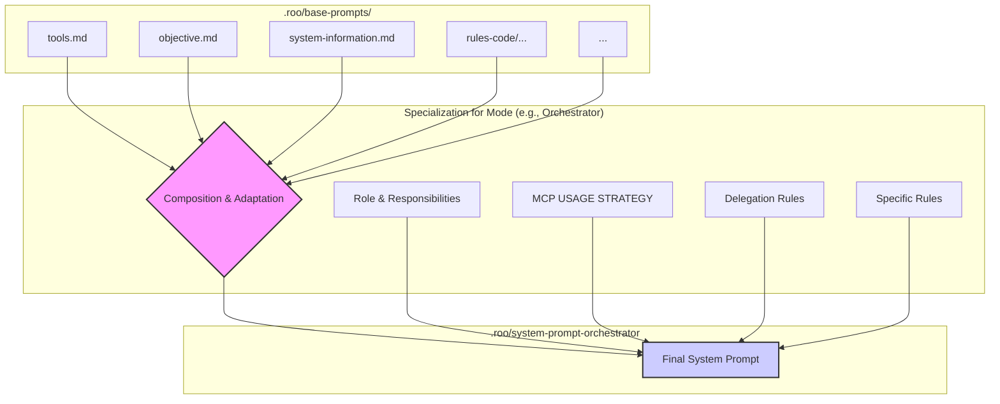

# Prompts

This document describes a multi-agent intelligent system integrated into a next-generation intelligent integrated development environment (IDE), built around the concept of deep integration of agentic LLM systems into the programming process. This agent system is capable of understanding user intentions, planning complex action chains, delegating tasks, and adapting to context.

## System Architecture

### Key Components

- **Roo**: A multi-agent system consisting of several specialized modes-agents, each responsible for specific aspects of software development.

- **Mode**: Specialized agents that perform various tasks during the development process. Each mode has unique capabilities and functions that allow it to perform its work effectively.

- **System Prompt**: The main instruction that defines the behavior and capabilities of each mode-agent in Roo. It includes information about available tools, functions, and ways of interacting with the user.

- **Tools**: Functions and APIs that can be used by mode-agents to perform tasks. Tools can include functions for working with code, APIs for interacting with external systems, and other useful resources. Tools are called using a special XML-like syntax that allows mode-agents to interact with them.

- **MCP Servers**: Special servers that provide additional tools and resources for task execution. Each server can offer different capabilities that can be used by mode-agents for more efficient task completion.

- **LLM**: The language model that Roo instructs with a specific system prompt, assigning it a particular mode, making it a specialized agent capable of performing tasks within that mode. The model receives instructions and context from the system prompt and then uses its capabilities to perform tasks, delegating them to other mode-agents or using available tools.

- **User**: The end-user who interacts with Roo and assigns tasks for execution. The user can ask questions, give commands, and expect Roo to perform tasks.

- **Branch**: User task execution consists of several stages, each representing a separate branch initiated by the preceding mode-agent via the `new_task` tool. Each dedicated branch returns its result to the parent branch after confirming task completion via the `attempt_completion` tool. Each branch is a specific mode-agent with its own context window. Branching allows Roo to efficiently handle complex tasks by breaking them down into smaller subtasks that can be performed by different mode-agents.

### Agent (LLM) Response Format

**Critically Important:** Every response generated by the LLM (acting within a specific mode) MUST end with a call to one of the available tools in a strictly defined XML format. The response should NEVER consist only of text or end with text after the XML tool tag.

**Response Structure:** `[Optional Explanatory Text] + [Mandatory Closing Tool Call in XML]`

The text part of the response (if present) is written in plain text without any surrounding tags. Immediately following the text (or at the beginning of the response if there is no text) is a single XML block with the tool call.

**Choosing the Closing Tool:**

1.  **Task Fully Completed:** If the text part of the response contains the final result and no further actions are required, use `<attempt_completion>`.
    *   Example:
        ```
        The architecture plan is ready.
        <attempt_completion><result>Plan details...</result></attempt_completion>
        ```
2.  **User Clarification Needed:** If information from the user is required to proceed, ask the question in the text and use `<ask_followup_question>`.
    *   Example:
        ```
        Need to clarify which database to use.
        <ask_followup_question><question>Which DB to choose: PostgreSQL or MySQL?</question></ask_followup_question>
        ```
3.  **Another Tool Required:** If the next step is an action (reading a file, searching, delegating), provide explanatory text (if needed) and end with a call to the *specific* tool.
    *   Example:
        ```
        First, I will read the configuration file.
        <read_file><path>config.json</path></read_file>
        ```

**Tool Format Reminder:** Always use the strict XML format: `<tool_name><parameter_name>value</parameter_name>...</tool_name>`.

**Incorrect Format (Avoid!):**
```markdown
<!-- INCORRECT: Text after the tool -->
<read_file><path>config.json</path></read_file>
File read.

<!-- INCORRECT: Tool wrapped in Markdown -->
\```xml
<read_file><path>config.json</path></read_file>
\```

<!-- INCORRECT: Text wrapped in tags -->
<text>First, I will read the configuration file.</text>
<read_file><path>config.json</path></read_file>
```

## Mode Hierarchy

There are 6 modes in total:

- **🆕 Task**: See [NEW-TASK-MODE.md](NEW-TASK-MODE.md) for a detailed description.
    - **ID**: `new-task`
    - **Can Spawn Tasks for Modes:**
        - orchestrator

- **🪃 Orchestrator**: See [ORCHESTRATOR-MODE.md](ORCHESTRATOR-MODE.md) for a detailed description.
    - **ID**: `orchestrator`
    - **Can Spawn Tasks for Modes:**
        - architect
        - code
        - debug
        - test

- **🏗️ Architect**: See [ARCHITECT-MODE.md](ARCHITECT-MODE.md) for a detailed description.
    - **ID**: `architect`
    - **Can Spawn Tasks for Modes:** none.

- **💻 Code**: See [CODE-MODE.md](CODE-MODE.md) for a detailed description.
    - **ID**: `code`
    - **Can Spawn Tasks for Modes:**
        - debug

- **🪲 Debug**: See [DEBUG-MODE.md](DEBUG-MODE.md) for a detailed description.
    - **ID**: `debug`
    - **Can Spawn Tasks for Modes:** none.

- **🔍 Test**: See [TEST-MODE.md](TEST-MODE.md) for a detailed description.
    - **ID**: `test`
    - **Can Spawn Tasks for Modes:**
        - debug 


Thus, the mode hierarchy looks as follows:

```
🆕 Task
  └── 🪃 Orchestrator
      ├── 🏗️ Architect
      ├── 💻 Code
      │   └── 🪲 Debug
      ├── 🔍 Test
      │   └── 🪲 Debug
      └── 🪲 Debug
```

🆕 Task can spawn a branch with the 🪃 Orchestrator mode. 🪃 Orchestrator can spawn branches with 🏗️ Architect, 💻 Code, 🔍 Test, and 🪲 Debug modes. 🏗️ Architect cannot spawn other branches. 💻 Code can only spawn 🪲 Debug branches. 🔍 Test can also only spawn 🪲 Debug branches. 🪲 Debug cannot spawn other branches.


## Branching with a Different Mode

When a mode-agent decides that it is necessary to branch off with another mode, it uses the `new_task` tool, which allows it to create a new task and pass it to another mode-agent. Each mode-agent has its own allowed modes with which it can interact. For example, the `💻 Code` mode-agent can only branch off to the `🪲 Debug` mode-agent, while the `🪃 Orchestrator` mode-agent can branch off to the `🏗️ Architect`, `💻 Code`, `🔍 Test`, and `🪲 Debug` mode-agents.

### How Branching Occurs

1. The mode-agent analyzes the current task and determines that it needs to branch off with another mode.
2. It uses the `new_task` tool to create a new task and pass it to another mode-agent.
3. When creating the new task, the mode-agent specifies which mode-agent will perform this task from the available allowed modes using the `mode` argument.
4. A detailed description of the delegated task, including all necessary parameters and context, is passed as the `message`.
5. The new mode-agent receives the task and begins its execution, using its own tools and capabilities.
6. After completing the task, the new mode-agent reports task completion via the `attempt_completion` tool, which returns the result to the parent branch.
7. The parent branch receives the task execution result and continues its work based on the received information.

### Structure of `message` in `new_task`

The `message` in the `new_task` tool must be structured as follows:

```
[emoji defining the mode] [short task description, no longer than 5-8 words]

[detailed task description including all necessary details, prerequisites, and requirements]

[additional context for task execution if necessary]

[current invocation tree]

[indication of the next step in the task execution tree]
```

For example:

##### Example Workflow (Code)

1.  **Receiving Task (from Orchestrator):**
    ```
    💻 Implement user profile update endpoint

    Create a new endpoint PUT /api/users/profile that accepts user profile data (name, email) and updates the authenticated user's record in the database. Use the existing database connection from `db.js` and validation logic from `validators.js`.

    Context: Project uses Express.js, user ID is available in `req.user.id`. Relevant files: `routes/users.js`, `models/user.js`, `lib/db.js`, `lib/validators.js`.

    🆕 Add user profile editing feature
    └── 🪃 Orchestrate profile editing implementation
        └── 💻 Implement user profile update endpoint
            ^ we are here

    Ensure proper error handling for database errors and validation failures. Return the updated user profile on success.
    ```

2.  **Analysis and Planning (`<thinking>`):**

    Architect mode analyzes the task and creates a plan for implementation.

    ```xml
    <thinking>
    Task: Design a scalable background task processing system for a web application.
    1. Requirements Analysis: Need asynchronous processing, fault tolerance, monitoring. Tech stack: Python/Flask, PostgreSQL, Redis.
    2. Architecture Options:
        a) Celery + Redis/RabbitMQ: Mature solution, good community, but complex setup.
        b) RQ (Redis Queue): Simpler than Celery, integrates well with Redis, but less feature-rich.
        c) Custom solution based on PostgreSQL (LISTEN/NOTIFY): Minimal dependencies, but requires more code for task management.
    3. Context Gathering:
        - Check current load and expected growth (`read_file` logs, `ask_followup_question` user).
        - Study Celery and RQ documentation (`context7`).
        - Search for Celery vs RQ comparisons (`tavily`).
    4. Decision: Considering the ease of integration with existing Redis and moderate task complexity, I recommend RQ.
    5. Plan:
        - Define RQ worker structure.
        - Design task queuing mechanism from Flask.
        - Describe task data format.
        - Propose monitoring scheme (RQ-Dashboard).
        - Prepare a Mermaid diagram.
    6. Next Step: Request RQ documentation via `context7`.
    </thinking>
    ```

    Code mode comes up with a detailed plan for implementing the user profile update endpoint, breaking it down into steps of writing code and identifying relevant files.
    ```xml
    <thinking>
    Task: Implement PUT /api/users/profile.
    1. Read existing files to understand the structure: `routes/users.js`, `models/user.js`, `lib/validators.js`.
    2. Plan changes:
        - Add a new route `router.put('/profile', ...)` in `routes/users.js`.
        - Inside the route:
            - Get `userId` from `req.user.id`.
            - Get `name`, `email` from `req.body`.
            - Validate `name` and `email` using `validators.js`.
            - Call model method `User.updateProfile(userId, { name, email })`.
            - Handle validation and DB errors.
            - Return updated profile or error.
        - Check/add `updateProfile` method in `models/user.js`.
    3. Start by reading `routes/users.js`.
    </thinking>
    ```

3.  **Reading File (Example Step):** Agent uses `<read_file><path>src/routes/users.js</path></read_file>`.
    *(Agent receives file content or error, analyzes it in the next `<thinking>` block, then decides to read the next file or start applying changes)*

4.  **Applying Changes (Example Step):** After analyzing files, the agent uses `<apply_diff>` or `<insert_content>` to add the new route and logic in `src/routes/users.js` and `src/models/user.js`.

5.  **Completion:** After applying all changes and (optionally) verifying via `<execute_command>`, the agent uses `<attempt_completion>`.

```
🪲 Fix 'Unknown option `--force`' error

We're getting an error when we try to run the command `npm install --force`. The error message is: "Unknown option `--force`". You have to fix this issue.

As additional context, the command is being run in the terminal and the current working directory is `/Users/andreyvavilov/Projects/meta-prompts`.

🆕 Initialize stub project
├── 🪃 Organize stub project creation
│   ├── 🏗️ Plan the structure of this project
│   ├── 💻 Install dependencies
│   │   ├── 🪲 Fix 'Unknown option `--force`' error
│   │   ^ we are here

In order to move on to configuring the project, you need to tackle this task and prove that it's done via the attempt_completion tool.
```

### What is an `invocation tree`

The `invocation tree` is a structure that shows the hierarchy of mode-agent calls. It helps understand which mode-agents were called, in what order, and which mode-agent we are currently in. Each mode-agent in the invocation tree is represented by its emoji and a short description of the task it performs. The invocation tree helps maintain context and track task execution in complex scenarios.

Example of what an `invocation tree` might look like:

```
🆕 Refactor user authentication module
└── 🪃 Orchestrate the refactoring process
##### Example Workflow (Debug)

    1.  **Receiving Task (from Code or Test):**
        ```
        🪲 Fix TypeError in calculateTotal

        Running tests (`npm test`) results in a TypeError: Cannot read properties of undefined (reading 'price') in the `calculateTotal` function in `src/utils.js` line 25.

        Test Output Snippet:
        ```
        TypeError: Cannot read properties of undefined (reading 'price')
            at calculateTotal (/Users/andreyvavilov/Projects/meta-prompts/src/utils.js:25:30)
            at Object.<anonymous> (/Users/andreyvavilов/Projects/meta-prompts/test/utils.test.js:15:9)
            ...
        ```

        Relevant files: `src/utils.js`, `test/utils.test.js`.

        🆕 Refactor user authentication module
        └── 🪃 Orchestrate the refactoring process
            └── 💻 Implement password hashing update
                └── 🪲 Fix TypeError in calculateTotal
                    ^ we are here

        Please identify the cause of the TypeError and apply a fix. Verify the fix by running `npm test`.
        ```

    2.  **Analysis and Planning (`<thinking>`):**
        ```xml
        <thinking>
        Task: Fix TypeError in `calculateTotal` (`src/utils.js:25`). Error 'Cannot read properties of undefined (reading 'price')'.
        1. Hypothesis: The function receives an element without the `price` property, possibly `undefined` or an object of a different type. Likely due to incorrect test data or improper handling of the input array in the function itself.
        2. Plan:
           - Read `src/utils.js` lines 20-30 to see the `calculateTotal` code.
           - Read `test/utils.test.js` lines 10-20 to see what data is passed in the test.
           - Determine the cause: incorrect test data or lack of checking in the function.
           - Apply the fix: either correct the test or add a check in `calculateTotal` (e.g., `item && item.price`).
           - Run `npm test` to verify.
        3. Start by reading `src/utils.js`.
        </thinking>
        ```

    3.  **Reading Files (Example Step):** Agent uses `<read_file><path>src/utils.js</path><start_line>20</start_line><end_line>30</end_line></read_file>`.
        *(Code analysis)*
        Then the agent uses `<read_file><path>test/utils.test.js</path><start_line>10</start_line><end_line>20</end_line></read_file>`.
        *(Test analysis, identifying the problem - e.g., passing `[ { price: 10 }, undefined ]`)*

    4.  **Applying Fix (Example Step):** The agent decides to add a check in the function and uses `<apply_diff>` to modify line 25 in `src/utils.js`.

    5.  **Verifying Fix (Example Step):** The agent uses `<execute_command><command>npm test</command></execute_command>`.
        *(Analysis of command output)*

    6.  **Completion:** If tests pass, the agent uses `<attempt_completion>`, describing the identified cause and the applied fix.
│   ├── 🏗️ Design new authentication flow
│   ├── 💻 Implement JWT token generation
│   │   └── 🪲 Fix token expiration logic error
│   ├── 💻 Implement password hashing update
│   └── 🔍 Test entire authentication flow
│   │   ├── 🪲 Debug crash on startup
│   │   ├── 🪲 Debug failing login test case
│   │   ^ we are here
```

This tree shows that the initial refactoring task (🆕 Refactor...) was passed to the orchestrator (🪃 Orchestrate...). The orchestrator spawned tasks for the architect (🏗️ Design...), two tasks for the coder (💻 Implement...), and one for the tester (🔍 Test...). One of the coding tasks required debugging (🪲 Fix...), and the testing task also revealed two problems requiring debugging (🪲 Debug...), and we are currently in this last debug branch for the second problem.

## System Prompts

System prompts define the behavior and capabilities of each mode-agent in Roo. They include information about available tools, functions, and ways of interacting with the user. Each mode-agent has its own system prompt, stored in the corresponding file in `.roo/system-prompt-<mode>`.

The original descriptions of all tools, base modes, MCP servers, etc., are stored in the `.roo/base-prompts/` directory. This serves as a knowledge base used to create system prompts for each mode-agent. Each mode-agent has its own system prompt, stored in the corresponding file in `.roo/system-prompt-<mode>`.

### System Prompt Structure

The system prompt consists of several main parts, structured according to the role and responsibility of the specific mode-agent. Let's examine the structure of prompts using the Orchestrator and New Task modes as examples:

#### Orchestrator

##### Example Workflow (Test)

1.  **Receiving Task (from Orchestrator):**
    ```
    🔍 Test user profile update endpoint

    The `code` mode has implemented the PUT /api/users/profile endpoint in `routes/users.js`. Please write and execute integration tests for this endpoint.

    Context: Project uses Jest for testing. Test files are located in `test/`. The endpoint expects { name, email } and updates the authenticated user. Assume a test user exists and authentication middleware can be mocked or bypassed for testing routes.

    🆕 Add user profile editing feature
    └── 🪃 Orchestrate profile editing implementation
        ├── 💻 Implement user profile update endpoint
        └── 🔍 Test user profile update endpoint
            ^ we are here

    Create a new test file `test/users.profile.test.js`. Include tests for:
    - Successful profile update (200 OK).
    - Update with invalid email format (400 Bad Request).
    - Update without authentication (401 Unauthorized - if applicable).
    Execute the tests using `npm test`. If tests fail due to application code bugs, delegate to `debug`.
    ```

2.  **Analysis and Planning (`<thinking>`):**
    ```xml
    <thinking>
    Task: Write and run integration tests for PUT /api/users/profile.
    1. Plan:
        - Create a new file `test/users.profile.test.js`.
        - Write tests using Jest and `supertest` (assuming it's in the project):
            - Test for successful update (POST with valid data, check status 200 and response).
            - Test for invalid email (POST with invalid email, check status 400).
            - Test for missing authentication (POST without token/session, check status 401).
        - Use `write_to_file` to create the file with tests.
        - Run tests via `execute_command npm test`.
        - Analyze the result. If errors in application code - delegate to `debug`.
    2. Start by creating the file `test/users.profile.test.js` with the basic test structure.
    </thinking>
    ```

3.  **Creating Test File (Example Step):** Agent uses `<write_to_file>` to create `test/users.profile.test.js` with the test content.

4.  **Running Tests (Example Step):** Agent uses `<execute_command><command>npm test -- test/users.profile.test.js</command></execute_command>`.
    *(Agent receives command output)*

5.  **Analyzing Results and Completion (Example Step):**
    *   **If tests pass:** Agent uses `<attempt_completion>` with the message "Integration tests for PUT /api/users/profile successfully created and passed."
    *   **If tests fail (error in application code):** Agent forms a message for the `debug` mode (including error output, invocation tree) and uses `<new_task><mode>debug</mode>...</new_task>`. After successful delegation, the agent uses `<attempt_completion>` with the message "Tests for PUT /api/users/profile created, but failed due to an error in the application code. The task to fix it has been delegated to the Debug mode."

The Orchestrator prompt begins with a clear description of its role and responsibilities:

```
As an orchestrator, you should:

1. When given a complex task, break it down into logical subtasks...
2. For each subtask, use the `new_task` tool to delegate...
3. Track and manage progress...
...
```

This is followed by standardized sections:

1. **TOOL USE**: Description of the tool usage format and a detailed list of available tools: `read_file`, `search_files`, `list_files`, `use_mcp_tool`, `ask_followup_question`, `attempt_completion`, `new_task`.

2. **MCP USAGE STRATEGY**: A specific section for the Orchestrator, describing the strategy for using MCP servers to gather context before task decomposition.

3. **MCP SERVERS**: Description of connected MCP servers (`context7`, `repomix`, `tavily`) and their tools.

4. **CAPABILITIES**: List of the mode's capabilities, including access to tools for executing commands, working with files, and interacting with MCP servers.

5. **MODES**: Description of available modes to which the Orchestrator can delegate tasks.

6. **RULES**: Rules and limitations for the Orchestrator mode.

7. **OBJECTIVE**: Final description of the goal and working methodology.

#### New Task

The New Task prompt has a different structure, oriented towards a more specific role:

1. **YOUR GOAL**: Detailed description of the mode's main goal - analyzing the user's request, gathering context, formulating a high-quality prompt, and delegating the task.

2. **Step-by-step process**: Detailed description of the workflow, starting with the mandatory first step (gathering system information) and ending with reporting the result.

3. **TOOL USING**: Detailed description of tools with special emphasis on their use in the context of specific process steps.

4. **OBJECTIVE**: Brief summary of the mode's goal and working methodology.

5. **SYSTEM INFORMATION**: Basic information about the user's system, indicating the need to gather additional information.

### General Principles of System Prompt Structuring

Based on the examples considered, the following principles can be highlighted:

1. **Role Orientation**: Each prompt begins with a clear definition of the mode-agent's role and responsibility.

2. **Standardized Sections**: Despite structural differences, all prompts contain standard sections: description of tools, capabilities, rules, and goals.

3. **Specialized Sections**: Depending on the mode's specifics, specialized sections may be added (e.g., MCP USAGE STRATEGY for Orchestrator).

4. **Process Orientation**: Each prompt contains a description of the mode's workflow, but the level of detail may vary.

5. **Tool Availability**: Clearly defines which tools are available to the mode and how to use them.

6. **Hierarchical Binding**: The prompt indicates which modes can be called by the current mode via the `new_task` tool.

### System Prompt Formation

The process of forming a system prompt includes:

1. **Composition from Base Prompts**: Basic components from `.roo/base-prompts/` (tools.md, objective.md, system-information.md, etc.) are combined and adapted.

2. **Role Specialization**: Specific instructions and recommendations are added according to the mode's role.

3. **Defining Tool Availability**: Specifies which tools and MCP servers are available.

4. **Setting Delegation Rules**: Defines which modes can be called via `new_task`.

5. **Establishing Rules and Limitations**: Specific rules and limitations for the mode are added.

Thus, system prompts are carefully structured instructions that define the behavior, capabilities, and interaction of mode-agents within the Roo multi-agent system.

#### Visualization of System Prompt Formation


## Individual Tool Usage Scenarios

Although all mode-agents have access to a certain set of tools, the nature and purpose of their use differ significantly depending on the mode's specialization.

### General Principles

1. **Adaptation to Specialization**: Each mode uses common tools in its own way, adapting them to its role. For example, `read_file` for the Architect mode serves to understand code architecture, while for Debug, it's used to locate errors.

2. **Semantic Difference**: Despite identical call syntax, the semantics of tool usage change between modes. For instance, `search_files` for the Code mode looks for patterns for refactoring, while for Test, it searches for test coverage.

3. **Usage Sequence**: Depending on the mode, tools are applied in different sequences to achieve the goal. For example:

   **Example for Code mode:**
   ```
   read_file → list_code_definition_names → search_files → apply_diff → execute_command
   ```

   **Example for Debug mode:**
   ```
   execute_command (get logs) → read_file → search_files → apply_diff → execute_command (verify)
   ```

### Key Examples

- **Task** uses `execute_command` at the beginning of its work in a specific way: the command `pwd && tree --gitignore && npx -y envinfo --markdown && npm run` is executed mandatorily to gather context before analyzing the task.

- **Orchestrator** applies `use_mcp_tool` strategically, according to the `MCP USAGE STRATEGY`, to gather necessary context before decomposing the task into subtasks for other modes.

- Some modes have limited use of the `new_task` tool. For example, Code can delegate tasks only to the Debug mode, while Orchestrator can delegate tasks to all modes.

## Individual MCP Server Usage Scenarios

MCP servers extend the capabilities of mode-agents by providing access to external resources and specialized tools. Different modes use them differently.

### General Principles

1. **Targeted Use**: Each mode accesses MCP servers with unique goals corresponding to its specialization.

2. **Strategic Choice**: Modes choose a specific MCP server depending on the type of information or action needed:
   - `context7` — for documentation and APIs;
   - `repomix` — for analyzing codebases;
   - `tavily` — for web searches;
   - `browser-tools-mcp` — for debugging web applications.

3. **Phased Process**: MCP server usage follows a general pattern:
   - Identify need → Select server → Call tool → Process result

### Key Examples

- **Orchestrator** uses `context7` to obtain official documentation when the task mentions specific technologies (e.g., React, AWS SDK). First, `resolve-library-id` is called, followed by `get-library-docs`.

- **Code** and **Debug** modes use `tavily` differently: Code searches for implementation examples and best practices, while Debug focuses on finding solutions for specific errors and debugging methods.

- For complex codebase changes, the **Architect** mode might use `repomix` with the `pack_codebase` tool to create a compressed representation of the codebase, helping to understand inter-component relationships before designing architectural changes.

The strategy for using MCP servers plays a critical role in enhancing the quality of mode-agent work, allowing them to obtain up-to-date information from external sources and make more informed decisions.

## Usage Scenarios, Workflow Algorithm, and Decision Tree

Each mode in Roo has its own workflow algorithm, which, although adapting to specific tasks (non-deterministic), follows certain patterns and principles. These algorithms are formalized in the modes' system prompts and define the sequence of actions, decision-making, and interaction with other modes.

### General Concept of Mode Workflows

The workflow algorithms of mode-agents are not just linear sequences of actions but complex adaptive processes that react to the task context and the results of previous actions. Although these algorithms are not fully deterministic, they follow specific patterns embedded in the system prompt.

### Algorithmic Patterns of Modes

#### Orchestrator

The Orchestrator's workflow represents the most complex process in the system:

1. **Context and Knowledge Gathering**:
   - Analysis of the initial user request
   - Study of the codebase structure via `list_files` and `read_file`
   - Collection of documentation for mentioned technologies via `context7`
   - If necessary, codebase analysis via `repomix`
   - Search for relevant information on the internet via `tavily`

2. **Task Decomposition** into logical subtasks with identification of their dependencies

3. **Architecture Delegation** to the Architect mode with transfer of gathered context

4. **Solution Implementation** through sequential creation of Code mode branches

5. **Testing** through alternation with Test mode branches

6. **Debugging and Fixing** by creating Debug branches when problems are detected

7. **Synthesis and Finalization** of results from all branches

#### Task Mode

The Task mode has a more rigid algorithm:

1. **Mandatory First Step**: gathering system information via `execute_command`
2. **User Request Analysis** and context enrichment
3. **Delegation** of the enriched request to the Orchestrator mode

### Integrating Tools into Algorithms

A crucial aspect of the algorithms is how they integrate tool usage into the sequence of steps. In system prompts, this is expressed as instructions on when and how to apply specific tools.

#### Example: Task and the Mandatory First Step

The Task mode's system prompt explicitly states that the first action must always be executing the command to gather system information:

```
MANDATORY First Step: Your very first action is ALWAYS to output the <execute_command> call for pwd && tree --gitignore && npx -y envinfo --markdown && npm run
```

This directly embeds the use of `execute_command` at the very beginning of the workflow algorithm.

### MCP Usage Strategies in Algorithms

Particularly interesting is how MCP server usage strategies are formalized within the algorithms. The Orchestrator's system prompt contains a special `MCP USAGE STRATEGY` section that details when and how to use various MCP servers:

```
Overarching Principle: Proactive Context Gathering
If fetching external context could reasonably improve the quality, accuracy, or safety of your plan or the instructions you delegate, you should prioritize doing so.
```

This strategy details a **decision tree** for using MCP servers:

1. **Check for Explicit Technology Mentions (`context7`)**:
   - **Trigger**: Mention of specific libraries, frameworks, APIs, SDKs
   - **Action**: Mandatory call to `context7` to get documentation

2. **Assess Need for Codebase Overview (`repomix`)**:
   - **Trigger**: Complex changes to internal logic, potential impact on multiple files
   - **Action**: Recommended use of `repomix` to analyze codebase structure

3. **Consider Need for External Web Context (`tavily`)**:
   - **Trigger**: Need for information beyond official documentation and the local codebase
   - **Action**: Use `tavily` for web searches

### Decision Trees in Algorithms

Mode algorithms are not linear sequences of actions – they are complex decision trees where each decision is based on the results of previous actions.

#### Example Decision Tree for Orchestrator Task Delegation

```
Analyze Task
├── Is the task related to architecture?
│   ├── YES → Delegate to Architect
│   └── NO → Continue analysis
├── Does the task require writing new code?
│   ├── YES → Delegate to Code
│   └── NO → Continue analysis
├── Is the task related to fixing errors?
│   ├── YES → Delegate to Debug
│   └── NO → Continue analysis
└── Is the task related to testing?
    ├── YES → Delegate to Test
    └── NO → Break down into subtasks and repeat analysis
```

### Formalizing Algorithms in System Prompts

The special value of system prompts lies in their formalization of these algorithms, turning them into concrete instructions for the LLM. For example, the beginning of the Orchestrator prompt defines the key steps:

```
As an orchestrator, you should:

1. When given a complex task, break it down into logical subtasks...
2. For each subtask, use the `new_task` tool to delegate...
3. Track and manage progress...
```

### Interaction of Algorithms of Different Modes

A key feature of Roo is that the algorithms of different modes interact, forming an integrated system:

1. **Task** → request enrichment → **Orchestrator**
2. **Orchestrator** → task decomposition → **Architect**/**Code**/**Test**/**Debug**
3. **Architect** → design → **Orchestrator** → **Code**
4. **Code** → implementation → **Debug** (if necessary)
5. **Test** → verification → **Debug** (if problems arise)

This interaction, formalized through delegation rules in system prompts, creates a cohesive system capable of solving complex programming tasks.

## Structured Thinking and Decision Making

A distinctive feature of Roo's system prompts is the use of `<thinking></thinking>` tags, which form the basis for structured thinking and decision-making by all mode-agents.

### Goals of Using Structured Thinking

- **Observability and Debugging**: `<thinking>` tags allow system developers to see not only the result but the entire decision-making process of the LLM. This is crucial for understanding why the model chose a particular tool or parameter, especially in cases of unexpected behavior.

- **Enforcing Process Adherence**: Requiring the articulation of analysis and planning steps within `<thinking>` forces the LLM to follow the complex instructions and multi-step algorithms described in the prompt more strictly.

- **Justifying Choices**: The model must explain why it chooses a specific tool or parameter, increasing the likelihood of a correct choice.

- **Self-Correction**: By verbalizing its plan, the model can potentially notice logical inconsistencies or missed steps before generating the tool call.

### Impact on the Decision-Making Process

Structured thinking guides the LLM to perform tasks methodically, reduces the likelihood of "cutting corners" or ignoring parts of instructions, improves the quality of tool and parameter selection, and makes the process more predictable.

### Specifics of Thinking in Different Modes

Although the `<thinking></thinking>` tag format is the same for all modes, the content of the thinking varies significantly:

- **Task (PromptEnhancer)**: Focuses on analyzing the user's initial request, assessing its feasibility in principle, identifying missing information to improve the prompt, planning the collection of this information, and the logic of prompt transformation.

- **Orchestrator**: Concentrates on task decomposition, choosing a delegation strategy, determining the need for context gathering (MCP, files), selecting the appropriate mode for a subtask, and analyzing the results of completed subtasks.

- **Architect**: Thinks about the codebase structure, possible architectural solutions, evaluates trade-offs between different approaches, and plans the most elegant architectural solution.

- **Code**: Analyzes the current code, identifies patterns, plans changes, and assesses their impact on other parts of the codebase.

- **Debug**: Forms hypotheses about the causes of a problem, plans steps to test these hypotheses, and analyzes the test results.

- **Test**: Identifies critical paths and edge cases, plans test cases, and analyzes code coverage.

### Example of Structured Thinking (Orchestrator)

```
<thinking>
Analyzing the task of creating a user authentication API.

1. Delegated subtasks and their status:
   - Architect (design API structure): Completed ✅
   - Code (implement login/registration routes): Completed ✅
   - Code (implement protected routes): Completed ✅
   - Test (test all routes): Completed ✅

2. Synthesizing results:
   - Architect designed the architecture using JWT, defined data structures and routes.
   - Code implemented registration, login, validation, token issuance, and verification.
   - Test confirmed the functionality of all routes and error handling.

3. Compliance with the original task:
   - ✅ Implemented authentication with login and password
   - ✅ Implemented JWT token issuance
   - ✅ Implemented token verification for protected routes
   - ✅ Added error handling and data validation

4. Conclusion: All aspects of the original task are satisfied. I can call attempt_completion.
</thinking>
```

### Importance of Self-Analysis for System Reliability

The self-analysis mechanisms in the Roo system perform several important functions:

1. **Preventing Premature Completion**: A mode will not report task completion until it is certain that all aspects are fulfilled.

2. **Ensuring Quality**: Critical evaluation of the result increases the likelihood of meeting user expectations.

3. **Adapting to Failures**: If self-analysis reveals shortcomings, the mode can take additional actions or re-delegate the same subtask.

4. **System Integrity**: Self-analysis ensures that each mode performs its role completely and correctly, which is critical for the functioning of the entire multi-agent system.

Thus, thorough self-analysis before task completion is an important mechanism for ensuring the reliability and quality of the Roo system's work.

## Data Flows in the System

The effective functioning of the Roo multi-agent system is based on clearly defined data flows between mode-agents and system components. These data flows ensure the transfer of context, requests, results, and metadata.

### Data Transfer Format Between Modes

The primary mechanism for data transfer between modes is the `new_task` tool. Key data is passed in the `message` parameter of this tool. The system prompts clearly regulate the structure of this message:

```
[emoji defining the mode] [short task description, no longer than 5-8 words]

[detailed task description including all necessary details, prerequisites, and requirements]

[additional context for task execution if necessary]

[current invocation tree]

[indication of the next step in the task execution tree]
```

This structured data transfer ensures not only the task itself but also all necessary context, execution history, and metadata about the position in the overall task hierarchy.

### Analysis of Subtask Execution Results

When a subtask completes, the parent mode (usually Orchestrator) receives a notification from the Roo system containing the XML call of the child mode's `attempt_completion`. The parent mode extracts the content of the `<result>` tag and analyzes its text content, comparing it with what was expected from that subtask.

For example, in the Orchestrator's system prompt, this is described as:

```
When a subtask completes (signaled by its attempt_completion call received via Roo), thoroughly analyze the <result> content provided by the subtask. Determine if the subtask's outcome meets the requirements you set.
```

Based on the result analysis, the Orchestrator decides on further actions:
- Proceed to the next subtask
- Gather additional information
- Ask the user a clarifying question
- Re-delegate the same subtask or a different subtask with modified instructions

### Information Transformation

In the Roo system, data undergoes various transformations as it passes through the modes:

#### Task → Orchestrator

1. The user's initial request is enriched with context and formalized.
2. Implicit requirements are made explicit.
3. Necessary technical details (paths, system information) are added.

#### Orchestrator → Execution Modes

1. The overall task is decomposed into specific subtasks.
2. Context gathered by the Orchestrator via MCP and other tools is added.
3. A clear scope and expected result are formulated for the specific mode.

#### Execution Modes → Orchestrator

1. Specific technical results are summarized.
2. Key aspects of the completed work are structured for analysis.
3. Metadata about the execution process is added.

#### Orchestrator → Task

1. Results from all subtasks are synthesized into a single cohesive result.
2. Technical details are abstracted to a level understandable by the user.
3. A final completion report is formulated.

### Examples of Data Flows

#### Scenario: Creating New Functionality

```
User → Task → Orchestrator → Architect → Orchestrator → Code → Orchestrator → Test → Orchestrator → Task → User
```

In this flow, the user's initial request undergoes the following transformations:
1. Task enriches the request with context
2. Orchestrator decomposes the task
3. Architect designs the architectural solution
4. Orchestrator integrates the architectural solution into instructions for Code
5. Code implements the functionality
6. Orchestrator checks the result and passes it to Test
7. Test verifies the functionality
8. Orchestrator synthesizes the final result
9. Task analyzes the result for compliance with the original request
10. User receives the final result

#### Scenario: Debugging

```
User → Task → Orchestrator → Debug → Orchestrator → Task → User
```

In this simpler flow, the debugging request undergoes fewer transformations, but each step involves a deeper analysis of the problem and context.

### Importance of Proper Data Flow Organization

Clearly regulated data flows in the Roo system ensure:

1. **Context Integrity**: All necessary information is transferred between modes.
2. **Traceability**: It's possible to track how the request was transformed at each stage.
3. **Informed Decisions**: Each mode has sufficient information to make decisions.
4. **Effective Communication**: Modes "speak the same language" thanks to standardized formats.

This approach to organizing data flows allows the Roo system to function effectively as a single organism, despite consisting of several specialized mode-agents with their own context windows.

## Best Practices for Creating System Prompts

The effectiveness of the Roo multi-agent system directly depends on the quality of the system prompts for each mode. Based on experience optimizing and refactoring system prompts, several key principles and practical recommendations can be formulated.

### Structuring System Prompts

A well-structured system prompt should contain the following mandatory elements:

1. **Header with emoji and clear mode name**:
   ```
   # 🪃 Orchestrator Mode
   ```

2. **"Role and Responsibilities" section** with a numbered list of the mode's main functions.

3. **"TOOL USE" section** with a detailed description of the tool call format and a detailed description of each available tool.

4. **Mode-specific sections** (e.g., "MCP USAGE STRATEGY" for Orchestrator).

5. **"RULES" section** with clear behavioral rules, including subsections for various aspects of work:
   - General principles
   - Filesystem operations
   - Task delegation
   - User interaction

6. **"OBJECTIVE" section** with a brief summary of the mode's goal and working methodology.

### Critical Elements Requiring Special Attention

When editing system prompts, special attention must be paid to the following critical elements:

1. **Message structure for `new_task`**:
   - Mandatory adherence to the format with emoji, short description, detailed instructions, context, invocation tree, and indication of the next step.
   - Inclusion of an example of a correctly formatted message.

2. **Concept of `invocation tree`**:
   - Detailed description of the rules for forming and maintaining the invocation tree.
   - Rules for marking the current position using "^ we are here".
   - Example of a correctly formatted invocation tree.

3. **Mechanisms for self-analysis and result evaluation**:
   - Clear criteria for checking before calling `attempt_completion`.
   - Checklists for verifying task completeness and quality.

4. **Error handling and fault tolerance**:
   - Limitation of retry attempts (maximum 3: 1 initial + 2 additional).
   - Progressive error handling strategy: from clarifying instructions to choosing alternative approaches.
   - Criteria for re-delegating a task or requesting information from the user.

5. **Output formatting**:
   - Strict rules on response structure (only `<thinking>` block and tool call).
   - Prohibition of any additional text or formatting.
   - Examples of correct and incorrect formatting.

### Checklist for Verifying System Prompts

When creating or updating a system prompt, it is recommended to check the following aspects:

- [ ] **Completeness of information**: All necessary tools, rules, and processes are described without omissions.
- [ ] **Structural consistency**: The prompt structure follows general principles but is adapted to the mode's specifics.
- [ ] **Delegation instructions**: Clearly defined modes to which this mode can delegate tasks.
- [ ] **Examples and samples**: Examples included for all critical aspects (message formats, invocation tree, etc.).
- [ ] **Error handling mechanisms**: Strategies defined for various types of errors and unsatisfactory results.
- [ ] **Formatting and readability**: Markdown formatting, emojis, headers, and other elements used to improve readability.
- [ ] **Direct address to LLM**: Prompt written in the form of direct instructions in the second person ("You must...", "Your task is...").
- [ ] **Balance of detail and brevity**: Information is detailed enough for understanding but not excessive.

### Typical Problems and Their Solutions

1. **Inconsistent formatting**:
   - **Solution**: Use a unified formatting style with emojis, headers, and separators for all system prompts.

2. **Missing or incomplete structure for delegation messages**:
   - **Solution**: Always include a full description of the message structure for `new_task` with an example.

3. **Insufficient error handling mechanisms**:
   - **Solution**: Add detailed instructions for handling various types of errors, including limiting the number of retries.

4. **Excessive redundancy**:
   - **Solution**: Eliminate duplicate information while retaining critical instructions in multiple places for emphasis.

5. **Lack of self-analysis**:
   - **Solution**: Include clear criteria and checklists for self-analysis before task completion.

By following these recommendations when creating and updating system prompts, the efficiency, reliability, and predictability of the Roo multi-agent system can be significantly improved.

## Error Handling Mechanisms and Fault Tolerance

The Roo system includes well-thought-out mechanisms for error handling and fault tolerance, embedded in the system prompts of each mode.

### Types of Handled Errors

The system distinguishes the following types of potential errors:

- **Tool Call Errors**: Incorrect parameters (path, JSON), access errors, network errors when calling MCP, Roo system errors.

- **Unsatisfactory Subtask Results**: When a subtask completes formally successfully (returns `<result>`), but analysis of this result shows that the subtask's goal was not achieved.

- **Inability to Gather Information**: File not found, search yielded no results, MCP returned an error.

- **Fundamental Task Unfeasibility**: The user's request is incorrect or impossible to fulfill (identified during the analysis phase).

### Fault Tolerance Strategies

#### Retry

For correctable tool call errors (typos in paths, temporary network issues), up to 3 attempts are provided (1 initial + 2 retries). This is explicitly stated in the prompts, for example, in the Task mode:

```
If a previous tool call (for these tools) failed (due to parameter error or system issue from Roo), internally attempt to self-correct and decide on retrying up to two additional times (max 3 total attempts for that specific information gathering step).
```

#### Failure

If retries are exhausted, the error is uncorrectable, or necessary information is unavailable, modes acknowledge failure:

- **Task mode** uses the `complete_with_failure` tool to report the inability to complete the task.

- **Orchestrator** may request additional information via `ask_followup_question` or adapt the plan.

#### Re-delegation

A strategy specific to the Orchestrator:

```
When a subtask completes, thoroughly analyze the <result> content provided. Determine if the subtask's outcome meets the requirements. Based on this analysis, decide the next step: delegate the next subtask, gather more information, ask the user for clarification, or potentially re-delegate the same subtask with modified instructions if the previous attempt was insufficient.
```

The Orchestrator can modify the instructions (`message` in `new_task`) and delegate the same or a similar subtask again, possibly to a different mode.

#### Adapt Plan

The Orchestrator can adapt its decomposition and delegation plan based on the results or errors of subtasks. This is possible due to the incremental approach, where the next subtask is chosen based on the results of the previous ones.

### Criteria for Choosing Between Retry and Failure

- **Retry** is attempted when:
  - The error seems correctable (a typo in a parameter that the model can logically fix)
  - The error might be temporary (network error)
  - The number of attempts made is less than 3

- **Failure** is acknowledged when:
  - The error is fundamental (file/resource definitely does not exist)
  - All 3 retry attempts are exhausted
  - Information necessary to proceed cannot be gathered with available tools
  - Initial analysis showed the task itself is unfeasible

#### Visualization of Error Handling Decision Tree (Example: Orchestrator)

```mermaid
graph TD
    A[Received subtask result/error] --> B{Analyze result};
    B -- Successful & meets requirements? --> C[Proceed to next subtask];
    B -- Unsuccessful / Doesn't meet --> D{Error correctable? / Attempts < 3?};
    D -- Yes (e.g., parameter typo) --> E[Retry with corrections];
    D -- No --> F{Re-delegation possible?};
    F -- Yes (e.g., incomplete result) --> G[Modify instructions & re-delegate];
    F -- No --> H{Plan adaptation possible?};
    H -- Yes --> I[Adapt plan & continue];
    H -- No --> J{Ask user?};
    J -- Yes --> K[Use ask_followup_question];
    J -- No --> L[Acknowledge Failure (Fail)];

    E --> B;
    G --> B;
    I --> C;
    K --> B;

    style L fill:#fbb,stroke:#333,stroke-width:2px
    style C fill:#bfb,stroke:#333,stroke-width:2px
```

### Specifics of Error Handling in Different Modes

- **Task** focuses on checking the fundamental feasibility of the task and gathering the minimum necessary context before delegating to the Orchestrator.

- **Orchestrator** has the most complex error handling mechanisms, including re-delegation, plan adaptation, and user clarification.

- **Execution modes** (Code, Debug, Test, Architect) focus on handling errors within their specialization and may request clarifications or delegate debugging to other modes (e.g., Code → Debug).

These fault tolerance mechanisms ensure the high reliability of the Roo system, allowing it to handle various unforeseen situations and adapt to changing conditions.
